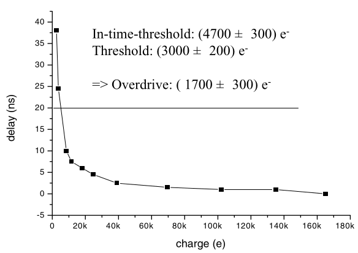

The purpose of this essay will be to study and quantify the design space of pixel detector systems, including the creation of a FOM. It will draw upon comparisons with other data conversion circuits like Image Sensors, ADCs, and TDCs.

To do this, we must build a model or incident radiation's interaction with matter. This model is in contrast to the discipling of 'gaussian/geometric optics' where beams of light are geometric light rays. This has the concept of [focal and image planes](https://en.wikipedia.org/wiki/Cardinal_point_(optics)#Focal_planes), etc. (Focal plane is the same as image plane but just in case on image coming from infinity.) By contrast are interested in single quanta detection. The other domain of this is the detection medium, which we'll model with a staring/plane array.

What we need to do is fix a temperature, a sensor material, and incoming particle type/energy range direction and radiation environment.

Then we create parametric limits on the thickness (to ensure energy loss doesn't dominate resolution of measuring particle direction, momentum, and energy.)

What resolution on energy does the calorimeter provide? Can a tracking sensor ever provide that?

A detector, vs imager, is something which has the concept of 'detection efficiency' take all the way to the quanta. We want every incident particle interacting with the sensor, and generating signal charge.

We want to measure particle kinematics, so particle direction, momentum, and energy. But we need to strip down and simplify this model to the context of what is definable in a single chip. We're going to abstract away the dimensions of:
- multiple layers increase in precision
- mass's decrease on precision
- recovery time/bunch crossing effect on pile-up/and  -> probability of loss of detection

So we'll essentially compress it down into: power budget, mass budget, detection efficiency by setting a limit below which these parameters will not be the bottleneck on performance.

The first constraint is precision for a single particle, passing through a plane array sensor. 

Basically, you want a high detection probability (low noise, )

There is a correspondence/connection between:

**Detector**: granularity, ENC, detection efficiency, timing resolution, timewalk, power per cm^2

**Imagers**: Noise Equivalent Quanta, Detective Quantum Efficiency, and Quantum Effienciy.

**ADCs**: Technology (getting better or worse?) vs architecture front, ENOB, Nyquist limit, fundamental limit on kT noise, 

* https://www.analog.com/en/technical-articles/a-12-b-10-gss-interleaved-pipeline-adc-in-28-nm-cmos-tech.html
* https://ewh.ieee.org/r5/dallas/sscs/slides/20120829dallas.pdf
* http://www.hit.bme.hu/~papay/edu/DSP/adc2000.htm
* https://www.youtube.com/watch?v=doTHd0W9QhA

In general, arbitrarily high resolution is achievable up to the noise floor, at the maximum single stage speed can be achieved, if you if you are willing to spend more power via pipelines. Put differently, pipe-lining is a way to improve resolution, at a fixed speed, by spending more power. It is limited by device noise, most probably dominated by the those in the first stage. 

Double sampling, flat-field correction, dark frame subtration, noise shaping, and oversampling are a way to reduce noise, by taking subsequent measurements. Correlated double sample is primarily to fixed each pixel's offset (although it does a bit of noise shaping), just as flat-field correction and dark frame subtraction.

* Dark frame correction corrects variations in thermal noise, which originates from lattice vibrations, and occurs every when there is no signal exposure. In devices where charge is passed from pixels, pixels at the end of the chain will have worse additive thermal noise as they are bucket brigaded the longest along the array. In images this is possible, because images are integrated, and so we will be able to measure a higher than average noise power over the integration period in those pixels. ADCs, the equivalent to this thermal noise problem is solved by noise shaping, where again multiple measurements are averaged to improve confidence in the measurement. This comes at the expense of added power (I think, obviously?) as you must oversample.
  * I'm not sure how the 'order' of the noise shaping affects this.
* Flat field correction, in turn, fixes sensitivity variation which originates from random offsets in the devices, but not dynamic noise sources, typically. (Of course this will change with environmental conditions and radiation damage, etc.) 
* In imaging, the additive error (dark current noise power) and multiplicative effect are removed via the expression $(input-dark)/(flatfield)$. Notes that the input frame and dark frame should have had the same exposure time.
* Note that these are post processing techniques, not in hardware, and that they are both removing 'fixed pattern noise' in the sensor. The hardware equivalent to this is pixel calibration techniques, although this mainly applies to sensitivity i.e. threshold tuning. I don't know if there's a good way to correct 'hot pixels' as detectors are inherently single shot. I think that this latter parameter is expressed as ENC?

 For example, if a single stage has an uncertainty, 

The can be done either by improving a single stage, or by chaining 

I'm adding TDC's in here, because their single shot precision requirement helps me connect to 

Also, I think I can take an ADC and reduce it down to a 1-bit design, in order to better compare it to a detector.... Meaning I can look at the charts of ADCs, but at the 1-bit level to understand the theoretical limits?

>  What is the poisson limit? The Poisson limit is a statistical concept that describes the behavior of a counting process when the number of events being counted is large and the probability of any one event occurring is small. In this limit, the counting process can be well-approximated by a Poisson distribution, which describes the probability of a certain number of events occurring in a given time period or space. 
>
> In the Poisson limit, the variance of the counting process is approximately equal to the mean of the process, which means that the standard deviation of the counting process is proportional to the square root of the mean. This has important implications for the measurement of low light levels, as it means that the signal-to-noise ratio (SNR) of the measurement is proportional to the square root of the number of photons detected.
>
> For example, in a typical photon-counting experiment, the number of photons detected in a given time period will be proportional to the intensity of the light source multiplied by the detection efficiency of the detector. In the Poisson limit, the distribution of the number of photons detected will be well-approximated by a Poisson distribution, and the standard deviation of the number of photons detected will be proportional to the square root of the mean. This means that as the intensity of the light source decreases, the SNR of the measurement will also decrease, and the measurement will become increasingly noisy.
>
> The Poisson limit is an important concept in many areas of physics and engineering, particularly in the measurement of low light levels and the detection of weak signals. Understanding the Poisson limit can help researchers to design experiments and instruments that are optimized for low light-level measurements and other applications where signal-to-noise ratio is critical.

In pixel detectors, ENC or Equivalent Noise Charge (ENC), which is defined as the
input charge for which the front-end Signal-to-Noise ratio is equal to 1. It's not 'dependent' on input charge level, because it, itself, is specified at a certain input charge level. But perhaps it's dependent on the threshold level? Yes I think it is. So we can compare the 

| Parameters | ADCs | TDCs | Imagers | Detectors |
| -------- | --- | --- | ----- | ------- |
|            |       |       |         |           |
|            |       |       |         |           |
|            |       |       |         |           |
|            |       |       |         |           |
|            |       |       |         |           |
|            |       |       |         |           |

This might be worth a read: https://ieeexplore.ieee.org/document/5204577/

More importantly though, I want to examine this paper from Andrea Galliani: https://www.mdpi.com/2079-9292/12/9/2054

I met him at CERN! This would be super helpful, as it would allow me to compare the performance of such a design against that I can do with a VCO. I need to look at the linearity, speed, size, signal to noise ratio, etc. It's only 6.5 um by 22.5 um! It consumes 2.2uA, which works out to 2uW off a 0.9V supply.

A... also rivetti's groups is at it as well: https://iopscience.iop.org/article/10.1088/1748-0221/17/03/C03022 It uses 1.2-> 2.5 W/cm^2:

> The Timespot1 ASIC has been tested in standalone configuration. The TDC resolution is below
> 50 ps, with an average of 23 ps. From the point of view of the AFE the resolution has been
> quantified to be under 100 ps with an average of 43 ps. All measures have been performed within
> the specified power consumption constraint of 40 μW per pixel. The tests illustrated in the present
> paper show the possibility of improving the performance of the proposed architecture with minor
> corrections. Measurements with the actual sensor matrix and particle generated signals will be
> performed in the near future.

# Discoveries

VCOs **have** been used for CSAs in detectors: https://oparu.uni-ulm.de/xmlui/handle/123456789/3224;jsessionid=123DA682C20AD08FC79D12EFCDEFCD98

And here is an interesting paper, talking about similar problems but for mass spectrometers: https://nano.lab.indiana.edu/wp-content/uploads/2020/07/Todd_2020_JASMS.pdf

# Monopix2 Notes

* The resistivity and the voltage determines how much you can deplete. Depletion is necessary because it allows all of your signal to be swept by drift, rather than some of it being collected by diffusion.
* The limit on voltage is the punch through effect, where the diode break down. Is this the dielectric breaking down? 

* Ivan Peric first published work on HV-CMOS, where people said 'well it doesn't matter if you have high-resistivity, because we can just apply a large external voltage to modern processes

* Other people, around the same time (2005-ish) said, whoah, wait, what if you just tuned the resistivity, but doesn't use a high voltage. They created what's called "HR-CMOS" detectors.
* These two detectors camps acted similarly after being irradiated, but did differ some during the beginning of their operation.

* Over time, these two MAPS camps have come together, and the byproduct is detectors with both HR and HV. Primarily these ones of interest are TJMonopix and LFMonopix/MALTA. (MALTA is essentially the same, but has had peripheral circuits designed.) Dr. Norbert Wermes likes to call this 'DMAPS', or Depletable Monolithic Active Pixel Sensors, as the combination of HV and HR allows for full or near full depletion.
* The Czochralski (CZ) method is a way to make substrates. It can be used to make high or low resistivity substrates. The alternative is using an epitaxial layer, which allows for a high-quality but thin layer of high resistivity material to construct a portion of the diode.
* LF monopix
  * Large fill factor, RO electronics are actually inside the collection node, which is sort of 'underneath'
  * Rev2 versions tested are backthinned to 100um thick, to reduce material
  * uses a standard CSA, as the large collection format creates a large pixel capacitance (~250 fF).
  * Power consumption of 370 mW/cm^2 or 28 uW /pixel. 
* TJ monopix
  * is a Small Fill Factor design, which has only a portion of it's pixel area action as the collection node.
  * Electronics are fully seperated from collection node
  * Process modification used to enhance charge collection ability... I this the epitaxy?
  * Additionally, it is a bit strange because it has two opposing voltage applied, rather than one large bias voltage. (How big is this voltage?).
  * One issue with this is the fact that small collection node causes some areas to be far from the node, and the horizontal field isn't strong enough to sweep up the charge properly. 
    * Some process modification, with either a opposite doped region, or just no epitaxial deposition (allowing regular p type to remain) counteracts this by removing the areas that were previous acting as dead-zones trapping signal charge
  * Uses the concept of 

Talking more with Ivan, there were three original flavors. 180nm from AMS/TSI, which has been led by Ivan Peric, and which became ATLAS pix. (peric also made Deptfet and FEI3) It has been customized for many different applications now, all under the HVCMOS label. Then there was the TJMonopix/TJMalta which family which started at CERN, in ALICE, and as a non-rad hard design with epitaxial layer (not called TJ), but then which received process modifications (intermediate n layer and end stops) to become the rad-hard TJ family. It was worked on by Ivan,It competed with ATLAS pix for the outerlayer of the ATLAS HLC upgrade, but neither won, as the whole ATLAS detector is now just RD53. The only potential outlet for TJ technology now is the Belle upgrade. This is called the 'Obelix' project. Finally the LFMonopix family, which doesn't have any process modifications, and which is large fill-factor like ATLASpix. This design has been tested in a  progression has been the major responsibility of Toko, Ivan, and Lars.

I should check who worked on what, like Kunis, Kostas, Piotr, Tomek?

#### Questions:

* Is the TDAC in both LF/TJ reused across the entire array? How is that calibration done? Is this essentially just 'flat-field' correction from basic image processors?

* What exactly is the punch through effect?

* What is the power consumption per pixel and per cm^2 for RD53? How does the width of the sensor stack compare?

* Christian is testing...if the epi layer is fully depleting?

* What is 'collection efficiency?' How does it relate to charge trapping?

* What is threshold overdrive, how does it relate to speed, and why is it measured in electrons?

* How does the size of a capacitor affect noise? What is 'equivalent noise charge'?
* Threshold dispersions/tuning (~100e)
* How does a beam telescope work? How do you ensure even energy of particles hitting the sensor? Is it one particle at a time, or a calibrated and continous fixed flux? How does a beam telescope differ from 

* For time walk calculations, is the 'seed pixel' considered the pixel with the highest value hit, and assumed to have 'no time walk' as a reference?

I'm reading about Noise Equivalent Quanta, Detective Quantum Efficiency, and Quantum Effienciy. The difference is, these are imaging measurements. We are no-fundamentally 'imagining', because we aren't reflecting particle off something, to measure something else. We want to learn about the particles themselves. This means our system measurement is 'single shot'. We don't to take another frame, in order to improve SNR. (Or do we??..) Also, we have radiation to deal with, and the fact that our measurements are 

# Pixel Detector Figure of Merit

"Imagers with larger numbers of pixels are considered to offer superior  spatial resolution, for example. But in order to increase the pixel  number without increasing the chip size, the size of pixel is reduced.  Does this imply finer details in the resulting images? A small pixel  also means less area for the photogeneration process or a loss of signal strength. In addition, smaller pixels may have higher cross-coupling,  so what impact would it have on image quality? Also, how do common  parameters like signal-to-noise ratio (SNR), dark current, fill factor,  full-well capacity, and sensitivity interact with image quality? Is  there any imager performance tradeoff involved among different  categories? How can one tell which imager has a better design?"

Basically though we can boil it down to spacial resolution, temporal resolution,  and dynamic range. But there is a complicated interplay between these.

But also power needs to be part of this.

For example, if pixels are smaller, more charge will be shared between  adjacent pixels when a particle hits, which produces signals closer to  the noise floor and with slower rise times more susceptible to jitter.  But also, quantization noise is reduced, as the nominal pixel size is  decreased. Ultimately we will be limited by the larger of the two error  sources, and so one must not be singularly focused on improving one at  the expense of the other.

One beautiful  interrelation of detectors is that the power dissipation limit is  directly derived from spatial noise limitations, because cooling systems add mass that increase multiple scattering.

Probably Assuming analysis on a certain recovery time for the pixel and on a  certain technology is necessary, as otherwise two much differs. Perhaps  the design should also be fixed to a certain sensor tech, and only  consider 

## from RD53A Specs 2015:

"following discussions with ATLAS and CMS sensor developers, for RD53A we have assumed sensors have less than 100 fF per pixel and deliver a single pixel signal greater than 600 e− in at least one pixel for 99% of incident particles"

* 4uA per pixel in analog circuits
* <1 % hit loss from in pixel pile up
* noise occupancy per pixel < 10^-6, for 50fF load, in a 25ns interval
* <500mA/cm^2 limit, so 0.6 W/cm^2 if it were at 1.2V supply
* min threshold of 600e- and min in-time (<25ns timewalk) threshold of 1200e-.
* all these specs must be met at 500Mrad dose

signal to noise ratio: quantization noise and jitter/noise can be combined into one measurement

pixel pitch/area may also be able to be combined into this parameter too, as the spacial resolution of the pixels ultimately just allows for

It looks like, depending on the mode of operation, about 600e- of resolution and >= 4 bits of resolution are needed.

At a 600e- input threshold, 99% of hits are detected, within 25ns, and 

At 900e- threshold, 50% of hits are detected in any time, and at (+300e-) 1200e- 50% of hits are detected within 25ns. Only 1% of hits are allowed to be lost due to pileup. And with this threshold, only <10-6 of hits can be false positive.

10^-6 probability of false hit corresponds to a Gaussian tail beyond 4.75σ, with a 600e- threshold this gives us an input-referred ENC << 126e-. (<< as threshold dispersion across the chip add in quadrature). So think like 70e- ENC.

Total recovery time is <1 us.

Assuming 25ns bunch crossing, we have a 40 MHz operating frequency. The TOT speed is 40 or 80 MHz, and has a 4b readout.

Let's assume a high-resolution TDC (TOT or TOA) in-pixel; ideally on the order of 10-40ps RMS. It should be the input jitter of the signal will be around 50ps RMS. 

> Hit rate: up to 3 GHz/cm^2 (75 kHz average pixel hit rate). This is less useful for considering pileup, but is good for knowing digital link capacity needed.

The TOT was designed with a 4-bit counter (16 total counts). By setting the counter rate (40 MHZ) and return-to-baseline dissipator (respecting pile-up limits) we can tune how much input ke- corresponds to which bin. So for the first 8 counts, we want to reach 12ke-, for a gain of 1.5ke- per LSB in this region. For counts 8-15 though,  (above 12ke-) the gain increase by 4X, to 6ke- per LSB. 1.5×8+6×8 = 60ke total dynamic range, therefore.

With this system, the quantization noise LSB/2 = 750 e- (midrise quantizer) is going to dominate the input noise. The input noise is like ~100e?

But remember the system isn't just a charge and TOA digitized, it also needs to reject false noise hits below a certain threshold. This is unusual from a circuit perspective.

# Explainer for in-time threshold

In-time threshold, means a hit which can be correctly assigned to the correct 25ns bunch id. Hits close to the threshold may take a long time to be detected.

In this example, a signal will be detected with 50% probability if it is 3000e-, but assuming any time delay is permissable. If we instead want to have that within 20ns, we find the 50% detection probability at that point is 1.7ke- (overdrive) higher at 4700e- at the *in-time threshold.*

## questions:

* are the values for threshold (i.e. 600e-) input referred?
* why is power limited to 0.5-1.0W per cm^2?   A: Because of the 

### Some calculations from the above

In a 1cm^2 area we have 40,000 pixels w/ 50um pitch
Therefore, given total power of 0.6 W/cm^2, so we can spend around 0.6W/40000 = 15 uW per 'pixel'.
Of course, the pixel has some digital periphery, and power is lower when there is no hit. So assuming that only 5uW can be consumed by the analog, 

## Power, cont:

* Pixel energy consumption inactive baseline when no in-pixel hit arrives

* Pixel energy consumption rise per hit (for a certain size, above threshold) actually doesn't matter, what matters is how this then dissipates into heat, which limits the pitch of the pixels. We don't want to conserve power, we just can't exceed our thermal limits.

Actually no, the power consumption should not simply be blindly reduced. Power consumption is a budget for performance! So assume a constant maximum power budget?, and simply optimize the best ways to spend this budget? Or perhaps increasing the decreasing power budget does actually improve performance, because mass matters?

Deadtime? Is there any need to have pixel dead times less than 25ns in the application of the LHC? 

Assuming each pixel produces data with the same number of output bits, we can therefore assume a fixed amount of area is necessary per pixel for data read-out, and we can abstract this

Should radiation hardness be a factor? Or should be simply just perform our measurements after a certain amount of radiation damage? I think the latter case is better.

Assume a standardized jitter for clocks available across the pixel matrix

# More basic approach

To optimize the circuit, I need a good equivalent circuit model for the characteristics of the signal, including noise, distortion, and detector capacitance. I know that the most basic detector is a PN junction? Or is it?

In any case, once I have an equivalent model, I believe it will be in the form of a current source with finite output impedance.

My goal is to measure the integrated area of a pulse, relative to some baseline.
Once issues with that is processing time. I have to observe a signal to it's completion to make a statement about it's integrated area.
There are different camps here. On camp integrates (accumulates) in a continuous fashion, and then measures (digitizes) the integrated quantity
Another camp integrates in smaller intervals, relative to the system dynamics, digitizes each, and adds up the result.
Image/video sensors are a example of the latter, as the signal of interest is generally continually present and varying, and so the system just defines a rate for sampling, relative probably to the rate of dynamics in the light signal of interest. If you're interested in faster changing events, you have to sample faster.

What does sampling theory tell us about pulse signals through, localized in time. Are we still faithfully trying to 'recreate' that waveform? Perhaps not.

# Comparison of RD53 Front-ends:

https://agenda.infn.it/event/22737/contributions/113830/attachments/72078/90767/2020-04-20_RD53_frontEnds.pdf

https://www.mdpi.com/2079-9292/12/9/2054

https://indico.cern.ch/event/806731/contributions/3503810/attachments/1926267/3188644/vertex_gaioni.pdf

# Things I'm interested in exploring:

The pixel detector system is interesting.

- It's asynchronously triggered, but needs to be well calibrated across an entire array.
- It doesn't integrate hits over time, but instead need to have single hit sensitivity
- Again, it's asynchronously triggered, but has a 25ns window in which it is free to digitize the signal. This means a signal *can* be freely expanded into this window.
- The initial threshold of ~600e needs to have a high precision, in that input noise referred noise must be < ~75e (<10^-6 errors, accounting for noise and static/dynamic threshold dispersion). Does it make sense to talk about a SNR here? What about a resolution or a LSB? It's a 1-bit quantizer?
- But then the subsequent conversions of higher amplitudes are of a LSB of around 1.5 ke- with 5-6 bits. What's the noise spec here? I think the SNR is like 35dB?
- And furthermore, there is a potentially a TOA digitization which is being maybe desired. This would have maybe a 1-2ns dynamic range. The input jitter would be arond 50ps RMS, with the TDC capable of around 20ps RMS.

*Therefore:*

- Can a VCO be used as the initial integrator? Let's examine it's transfer function. It's a leaky integrator, and can have a very high gain.
- If we still need a miller capacitance, perhaps we can still use the digital VCO output to create one?
- Can we reuse the high precision discriminator (1-bit quantizer) for subsequent digitization. I'm thinking something like an asynchronous delta-signal modulator. Measure change in input signal in unit interval, digitize with 1-bit quantizer, then feed this back to input to
  - digitally subtract from VCO output, if using that
  - or use DAC to convert to voltage, and analogly subtract from CSE output (which is buffered)

# making sense of SNR and ENOB

For ADCs, it doesn't make much sense to specify the dynamic range often, as an input signal that is out of range can simply be amplified to fit within the full scale input range. (This amplification has some linearity(distortion) and noise penalty of course.)

Therefore we often compare converters at some nominal input signal range.

SNR of a signal make sense. But for a data converter, you need to essentially fix an input signal level for which you desire to measure. For example, if you have a TDC where you can add as many delay stages as you want, if you don't scale a signal, having more stages won't help, and if you do scale (amplify it), you will reduce the dynamic range while 

There is a reason dynamic range is not the most important spec to quote for a data converter, and that's because dynamic range is relatively easy to increase. For a TDC, for example, you can just add more stages. What doesn't come cheaply is LSB. 

> A converter’s differential linearity must be <1 LSB regardless of the specified resolution. Also, a converter’s integral linearity determines its distortion performance, so converters with higher resolution can achieve higher SFDR.

In SNR, you are computing a relative ratio; it's unitless. Therefore, 

