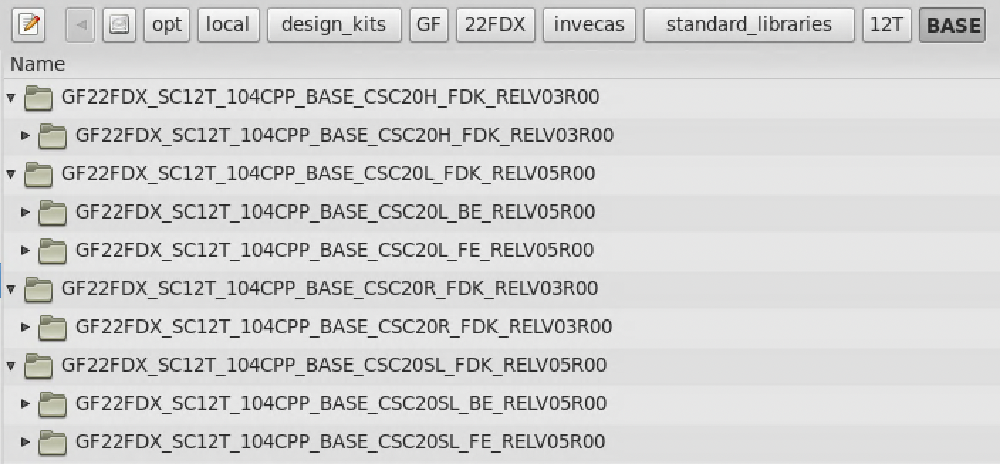
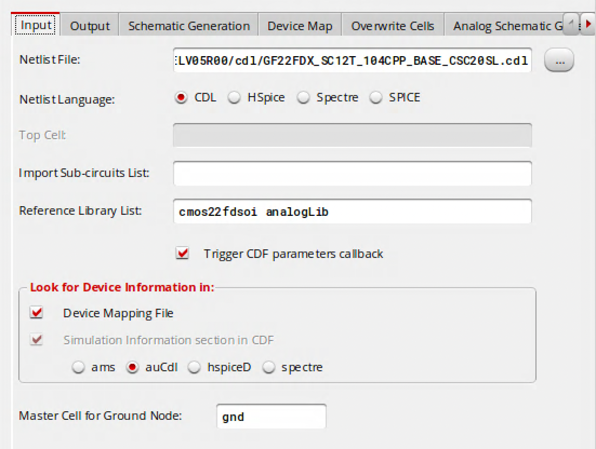
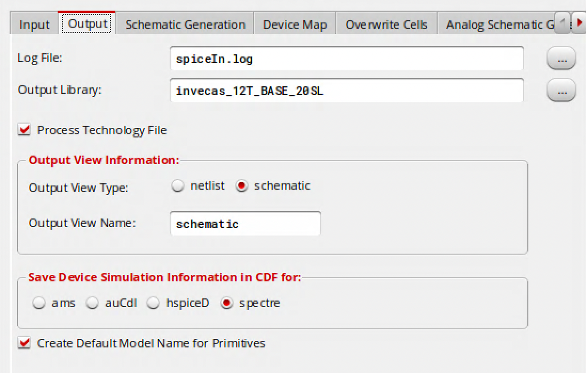
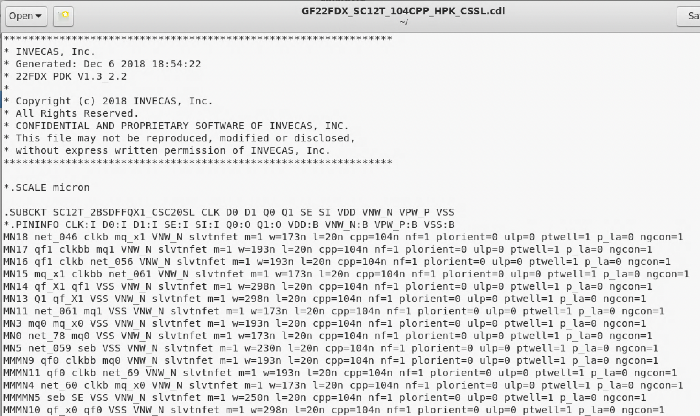
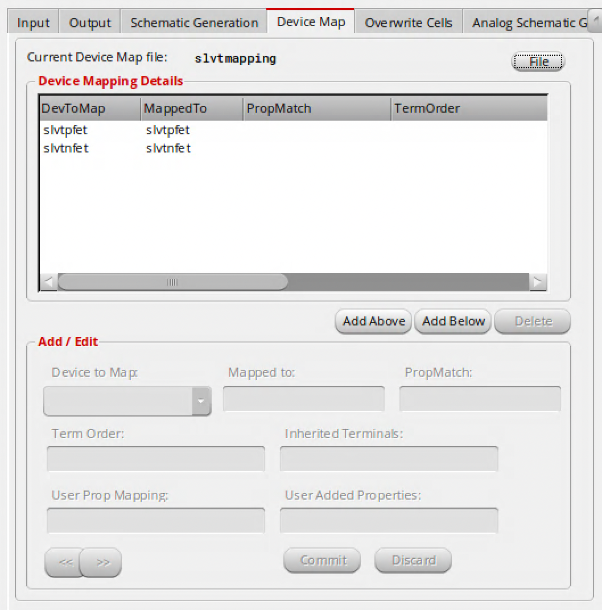
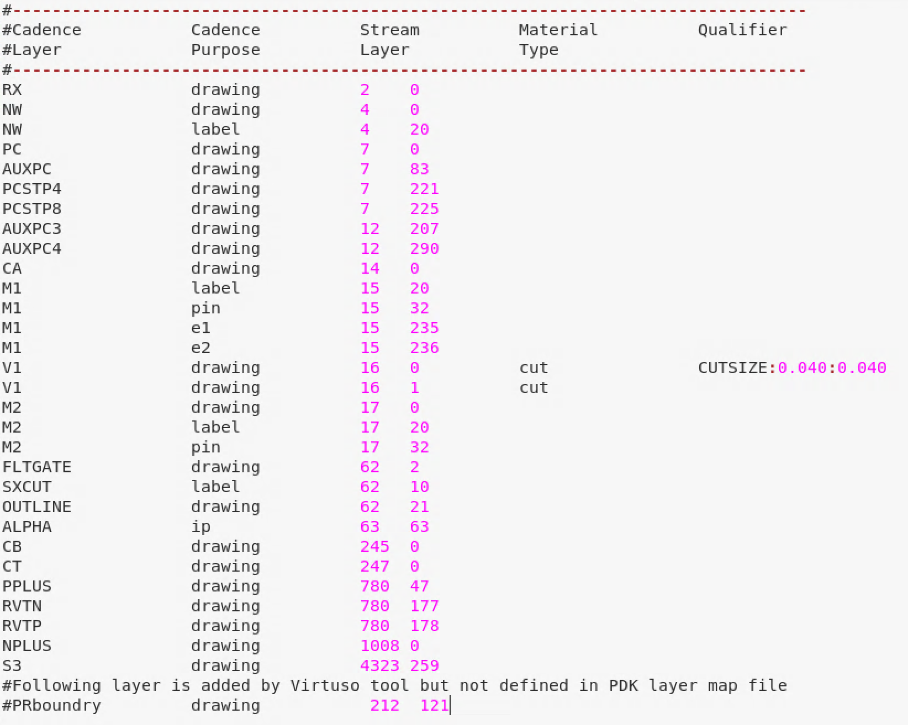
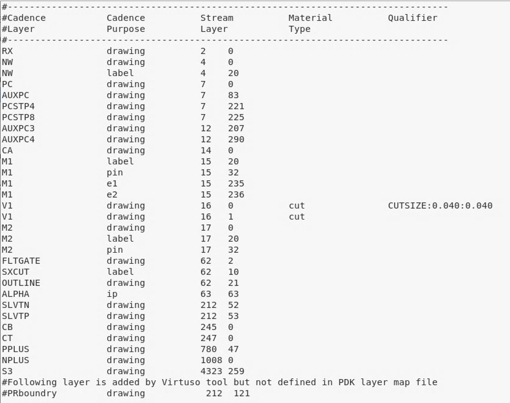
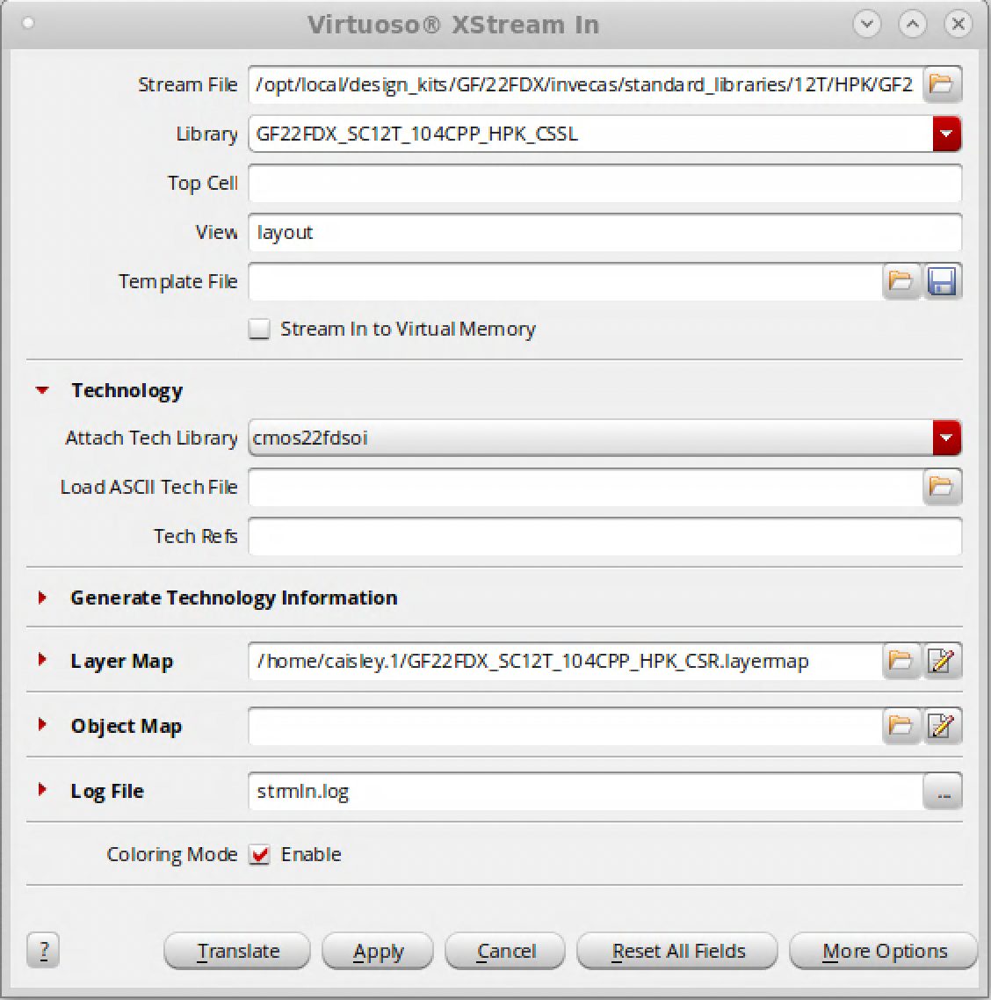

# 22FDX Standard Cell Import

This tutorial provides instructions for converting the Invecas standard cells available for the Global Foundries 22FDX process to the "Open Access" .OA format compatible with Cadence tools.

## Overview

Decide which of the many Invecas standard cell libraries you wish to convert to the native 'open access' format used by Cadence. There are over 100 libraries, with various configurations of threshold voltage, gate length, track height, and cell architecture (optimized for speed, area, or power). Each of these will have its own directory within the Invecas folder hierarchy located at

```
/opt/local/design_kits/GF/22FDX/invecas/
```

Importing the cells is a three-step process, as you need to convert the symbol, schematic, and layout cellviews. Note that the necessary steps will differ slightly depending on which specific library you want to convert to OA. This variations will be explained in the sections below.

## Step 0: Library Creation

Before importing the cellviews, first create a new empty library, attach the existing technology file `cmos22fdsoi`, and make sure it added to your path. Thus far, I've named the Cadence libraries with the same convention used in the Invecas directory. For example, the 12T BASE 20nm RVT device library would be `GF22FDX_SC12T_104CPP_BASE_CSC20R` and the 12T HPK ULVT device library would be `GF22FDX_SC12T_104CPP_HPK_CSSL`.

## Step 1: Symbol Cellviews

Once you have a library to contain the standard cells, you can proceed to importing them. Begin with the symbol cellviews, which can just be copied over, as they already exist in a native .OA format. It's important to start with the symbols, or else you will end up with duplicate entries each cell in the library.

The symbol cellview files are located two levels-deep inside the `cdslib` directory corresponding to each library. The folder hierarchy differs slightly for normal RVT/HVT libraries vs flip-well SLVT/LVT libraries. The flip-well libraries have two directories, 'BE' and 'FE', which I believe corresponds to 'back-end' and 'front-end'. Ignore the 'FE' directory, as it is missing many of the files we need, and use the 'BE' directory throughout this import process. This difference in directory structure can be seen in the example below for the four flavors of BASE 12T 20nm cells:



Be sure to copy cover only the cell contents of the `cdslib` directory (which are two levels down) and not the whole directory itself. For example, if you were wanting the cells for the BASE 12T 20nm RVT library you would copy the **contents** of:

```
/opt/local/design_kits/GF/22FDX/invecas/standard_libraries/12T/BASE/GF22FDX_SC12T_104CPP_BASE_CSC20R_FDK_RELV03R00/GF22FDX_SC12T_104CPP_BASE_CSC20R_FDK_RELV03R00/cdslib/GF22FDX_SC12T_104CPP_BASE_CSC20R
```

And if you were wanting the cells for the BASE 12T 20nm SLVT library you would copy, again, the **contents** of:

```
/opt/local/design_kits/GF/22FDX/invecas/standard_libraries/12T/BASE/GF22FDX_SC12T_104CPP_BASE_CSC20SL_FDK_RELV05R00/GF22FDX_SC12T_104CPP_BASE_CSC20SL_BE_RELV05R00/GF22FDX_SC12T_104CPP_BASE_CSC20SL_FDK_RELV05R00/cdslib/GF22FDX_SC12T_104CPP_BASE_CSC20SL
```
When you perform this step, make sure the `data.dm` file in the target empty Cadence library directory is overwritten with the `data.dm` file in the Invecas source directory. Refresh the Cadence Library Manager and check to make sure entries exist for each of the cells, and that those entries have an associated symbol cellview.

## Step 2: Schematic Cellviews

The schematic cellviews for a standard cell library are generated from a .CDL netlist, available inside the cdl directory nested within each library directory. This .CDL netlist requires a slight modification to be read in properly; don't make any modifications to the original file in the Invecas directory. Make a copy of the .CDL to somewhere in your local user directory, and add the following line to the beginning of the file:

```
*.SCALE micron
```

Place it before the first `.SUBCKT` statement, but after the file header comment block. This statement ensures that the schematic generation process reads the devices sizing information in the netlist correctly.

The CDL netlist is imported using the SpiceIn tool which can be launched from the Cadence Command Interpreter Window (CIW) via 

```
CIW -> File -> Import -> Spice...
```

On the Input page, target your modified copy of the Netlist file, change the Netlist language to `CDL`, set the Reference Library List to `cmos22fdsoi analogLib`, check the boxes for Trigger CDF parameters callback and Device Mapping File, and change the Simulation Information section to `auCdl`. It should look something like this:



On the Output page, set the log file to where you want it to go, target the Output Library that you created in Step 0, and Save Device Simulation Information in CDF for `spectre`. It should look something like this:



I would recommend changing the default log file directory, as it will generate a individual file for every single cell. By default it will put all of these in your Cadence launch directory, which will create a mess.

Finally, we must configure the Device Map for our import options. This is critical because the SpiceIn tool will default to mapping devices in the .CDL netlist to the RVT nfet/pfet devices in the cmos22fdsoi PDK. This default, of course, is wrong if chosen the standard cell library is using SLVT, LVT, or HVT devices. 

Examine the .CDL netlist file to figure out which devices are used. For example, if we were importing the 12T HPK ULVT library `GF22FDX_SC12T_104CPP_HPK_CSSL`, we see the .CDL netlist uses SLVT nfet and pfet devices:



In this example case, we would simply configure the Device map to use cmos22fdsoi `slvtnfet` and `slvtpfet` devices wherever they appear in the .CDL netlist. The configuration would look like this:




If one were importing a library with LVT or HVT devices, a similar process would be followed, with the respective device names. After setting the device map, you can click the "Ok" button to begin generating .OA schematics from the .CDL netlist. This process will take about 20 minutes.

After this complete, refresh the library manager and check that each of the cells now have schematic cellviews.

## Step 3: Layout Cellviews

The final step is to import the layouts which are contained in the respective `gds` directory for the selected library. Similar to the device map in the previous step, a layer map is needed to inform the import tool how to associate layers in the .GDS file with the layers available in the cmos22fdsoi PDK. Unfortunately, layer maps for some reason aren't provided for the libraries using flip-well devices. If you are importing a library using SLVT or LVT devices, make a copy the layermap file in the `gds` directory from a RVT library, and save it in your user directory. For example, if you're working in the HPK kit with the library using SLVT devices, you could grab the .layermap file for the similar RVT library at:

```
/opt/local/design_kits/GF/22FDX/invecas/standard_libraries/12T/HPK/RVT/FDK/GF22FDX_SC12T_104CPP_HPK_CSR_FDK_RELV01R00/GF22FDX_SC12T_104CPP_HPK_CSR_FDK_RELV01R00/gds
```

To make this layer map file work for your specific case, you'll need to delete the existing entries for the `RVTN` and `RVTP` layers, and replace it with the layers for SLVT/LVT devices. Here is an example from the 12T HPK RVT device library.



We will need to delete the two lines reading:

```
RVTN		   drawing	    780  177
RVTP		   drawing	    780  178
```

And add in lines for your SLVT or LVT devices. In the case of SLVT, I've figured out the right layers are:

```
SLVTN		   drawing	    212  52
SLVTP		   drawing	    212  53
```

I have yet to discover the correct layers for LVT devices. In the 12T HPK SLVT example from above, the correct layer map file would look like so:



**NOTE:** Be sure to add the lines into the file in the correct numerical location, based on the Stream Layer number. You can't add them anywhere in the file.

**NOTE:** Be sure to copy the similar RVT library for the same library class and track height as your desired SLVT/LVT library. For example, don't modify the 8T BASE RVT layer map if you're trying to import a 12T HPK LVT library. Use the 12T HPK RVT standard cell library .layermap file. Otherwise there will be differences beyond the replacing the RVTP and RVTN layers.

Once you have an appropriate layer map you can proceed to streaming in the .GDS file, using the XStream In tool, via:

```
CIW -> File -> Import -> Stream...
```

For Stream File, target the provided .GDS in the respective Invecas directory. Set Library to the library created in Step 0, set `cmos22fdsoi` for Attach Tech Library, and for Layer Map target the modified .layermap file you saved to your local used directory. Start the stream import process, which should only take a couple of seconds. The configuration should look something like this:



Refresh the Library Manager for a final time, and confirm that all the cell entries have an associated layout cellview.

## Step 4: Library Verification (Optional)

I would recommend verifying the layouts and schematics you've generated are DRC and LVS clean. If verified in a standalone fashion, the cellviews should be 100% LVS clean, but the layouts **will** DRC will have a few errors related to grounding. This is solved by using the 'endcap' cells at either end of a standard cell track run in a real layout.


