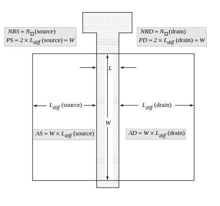
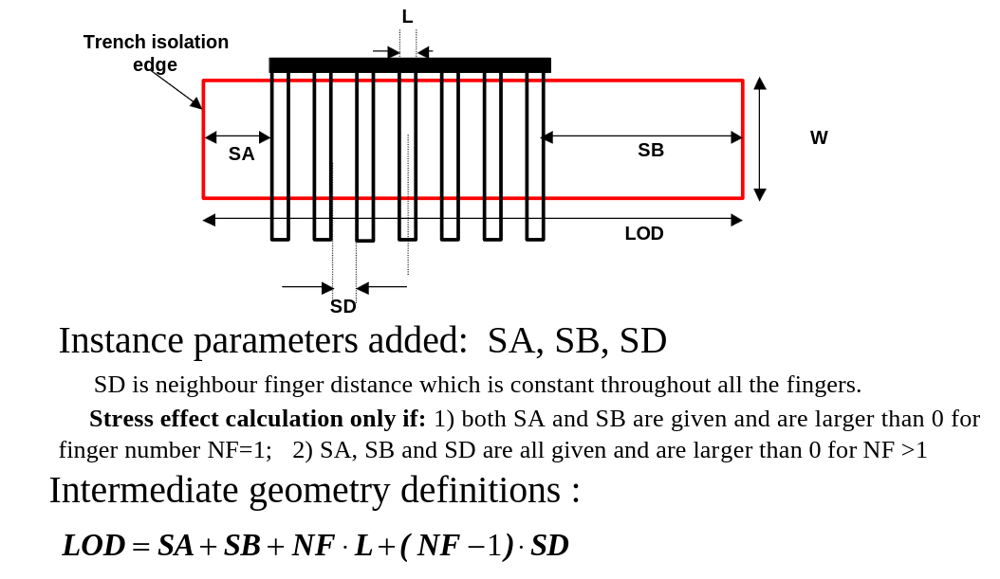
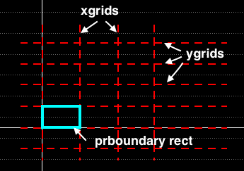
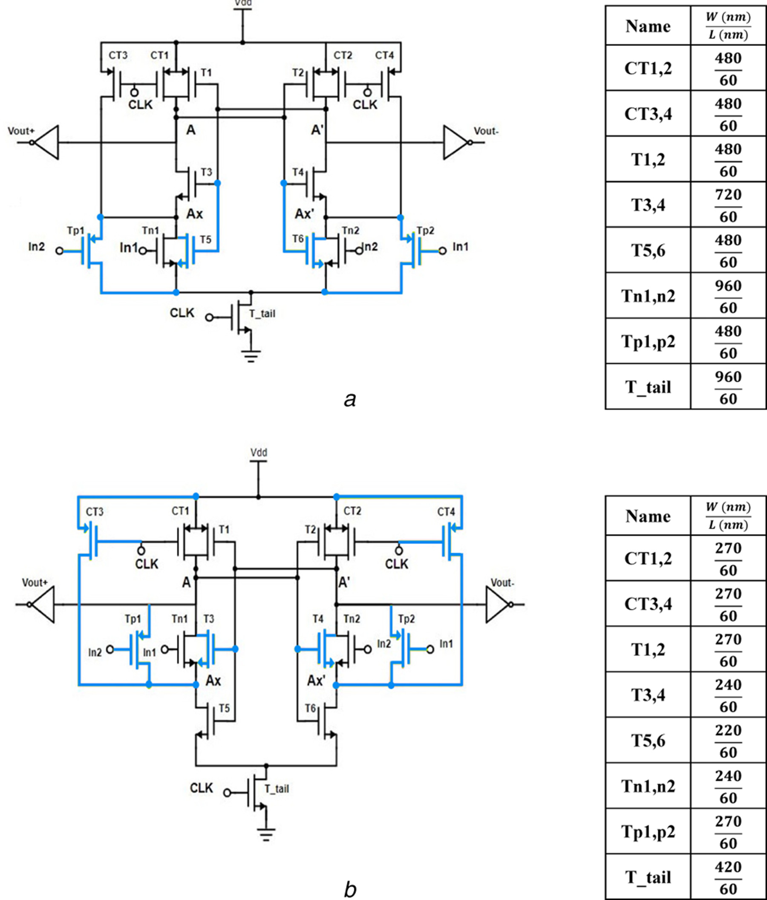
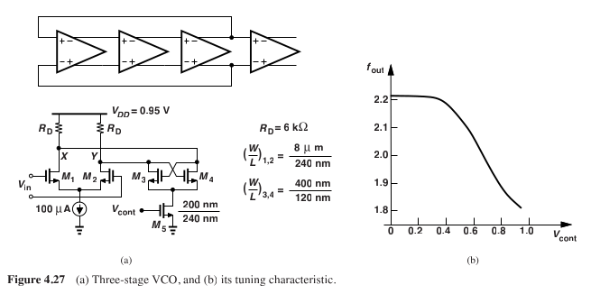
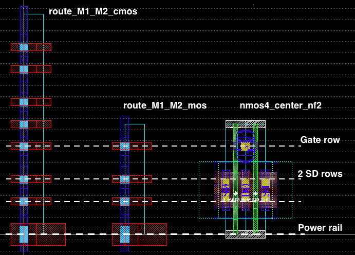
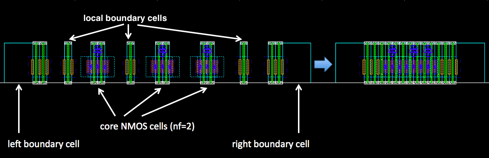
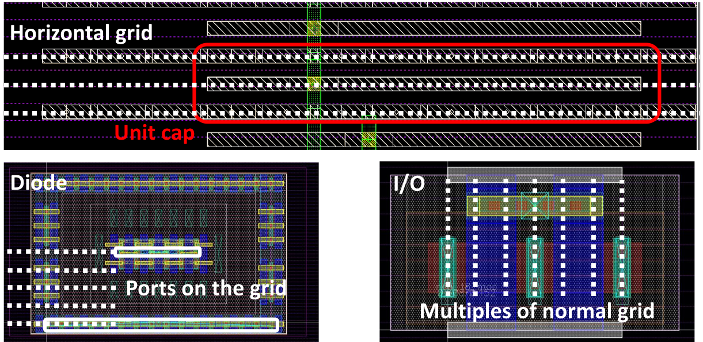

* Would the ExternalModules tools be the correct avenue for supporting Verilog-A models of devices? And let's say that we want to, at the system level, mix and match between transistor-level and behavioral models of say, an amplifier. How would this be best accommodated in HDL21.
    * To answer this, I need to understand what the netlist input to Spectre looks like, when mixed VA and SPICE netlists are fed in.
* Modules are created either via a:
    * procedural approach, where an object is created by passing passing a 
    * or class based definition, which uses a decorate. This feeds a user defined class into the decorator function, and spawns and output function?

* External modules can be used to include behavioral models, like Verilog and Verilog A.
* HDL21 is structural, and not behavioral at all (behavioral element comes from transistor models)
    * But that is how SPICE works too (raw, not including XSPICE, etc). It's essentially all 
    * Bundles are structured connections

* Layout21: Layered Rust libraries for layout
    * tetris - structured grid
    * raw - full custom
    * parsers for industry standard formats
    * It is a library, doesn't have a real user interface, and won't.
        * Look up 'Substrate' used in SRAM compiler project.

Other new integrations:
* Interfacing with ALIGN
* CktGym

Coming to VSCode:
* schematics
* rendering virtuoso schematics in vscode
* simulation testbench setup?

* Low hanging fruit: simulation modes matrix, basic examples -> will open starter issues

* Note how HDL21 doesn't address the layout implementation of cells. There's no strong notion of a layout cell paired with a corresponding schematic.
    * I might choose to use Layout21 libraries w/ tooling on top to accomplish this portion, or I might instead choose to use a mix of:
        * GDSFactory (cell)
        * Laygo2 (structural)
        * BAG+Xbase (cell + structural)
        * Klayout (structural)
    * This is a bit unfortunate, of course, as a large portion of my work will require silicon tested design.
    * I might like to customize the HDL21 flow a bit, so that the generation of layout cells is done in tandem with schematic cells.
    * This would be done before the structural level work is completed.
    * Also, I should like some way to exchange between netlist+model vs behavioral representations of systems.
    * Perhaps I do this by simply having a parallel set of python classes, build on something like OpenVAF?


# Hdl21 notes

External file, with PDK specific information. In this file, we should produce a family of transistors, and resistors.
Each one of these then receives an 'external module'? Wait no, I'm not dealing with layout at this point, just schematic sim.
Therefore, I can simply wrap my BSIM models with external modules, and parameterize them with some MosParams. I should also be able
to create my own sort of a macro model, which improves parasitic accuracy. Theses can be ideal capacitors, which can be removed during LVS comparison, and/or conversion to layout. 
Part of this stack should be a core transistor simulator, which extracts the parameters I can most about. I should be able to base my generator off a netlist. After examining what can be physically achieved by layout, we should develop a 'unit transistor' size, and then use those as the sizes which are evaluated via our simulation test bench. One can store those inside of `.npy` files.


Let's give up now with making the script process agnostic. Let's assume we just copy and modify, in order to port to a new technology.

Is there still a problem here? If we know the structure we want to generate, and what we want to achieve spec-wise, can we simply use design equations to achieve a well-optimized system? Let's assume we just know transistor level parameters. If we work from design equations, we could produce a family of inverters by taking the ratio of the transconductance of the devices as the P:N width ratio. Once that is instantiated, we can use a generator which produces a family of modules. The generator will take as an input the base length (not necessarily minimum size, for rad hard), the unit width (which is just nmos width, probably) (again not necessarily min size), and produce a family of inverter.

How do you work around the fact than an NMOS and PMOS probably shouldn't have the same width, in order to balance them? Maybe just make the unit width of the cell layouts that of the larger PMOS, and then simply have the NMOS take up less space?

The purpose of a generator is to take a collection of desired specs (sometimes parameterized, like an amplifier, sometimes always consistent, like a inverter), known properties about a technology, and a library of corresponding components, and produce one or more valid supercircuit that meet that spec.

So for an inverter generator, we'd give it the technology properties (extracted by schematic), and a subset of valid device sizes, and it would use it's internal knowledge of an inverter's topology, plus simulation-free feed-forward/open-loop design methodology, to produce a set of ExternalModule corresponding to Inv1, Inv2, Inv4, Inv8, Inv16, etc

Now, when we reuse these blocks, on the level of a ring oscillator, how do we write the generator? Can it be written to be agnostic of the process? Perhaps, if like the inverter generator, it is written to accept a variable for target technology?

Notice something interesting here though. As soon as we are one level of hierarchy above base level 'schematics' with transistors, we no longer need to be making decisions about transistor sizes, in the generator. That means that we could maybe take a library based approach, with pregenerated and characterized cells at the base level, and then simply make structural decisions, based on mechanistic design equations.

The opposite approach to the base level library is to have even the lowest level of transistor 'schematics' be parameterizable. Is this a good idea? not sure.

Assuming the library approach: When we draft these higher hierarchy design generators, when tempted to 'hardcode' a parameter, we should ask whether, in the context of our design, that parameter will need to be updated. Consider the case of a ring oscillator. The parameter for number of stages, frequency of oscillation, phase noise, and choice of unit cell are all interconnected, and not mutually independent. So which do I set as the input parameters? **This is a question to answer with Hans. And this is where I aim to be by next Wednesday. Perhaps even with both 28nm and 65nm**

# Other generator ideas

In parallel, in the process agnostic flow:
Start with a basic topology, using generic devices, embedded as a module inside of a generator.

Generators should be use to produce topology in generic tech, but not to size devices?

The issue is that the compile function needs to take a module as input, and modules don't have parameters, and so I would need to
know the sizes of devices before compiling.

Err on the side of producing all 'useful' combinations of a device, rather than iteratively solve for and only produce a specific instance
This will preserve the feed forward nature of the generator

Modules can't have any parameters. They need to be 'just data'. Is an unsized schematic, 'just data'?

Paramclass

Compile function from generic -> PDK tech

You have to define a class, but you don't have to create an param object from it before feeding it to a generator object.
If, in the definition of the corresponding generator object, it knows to expect a inp


# Code notes
When creating a module from a class, some additional fancy stuff is happening... it's not just the same as creating an object from a standard class. For example. If we run this:

```python
class TestClass:
    def __init__(self, value):
        self.value = value

objTestClass = TestClass(10)

print(TestClass)
print(objTestClass)
```

We get:

```python
<class '__main__.TestClass'>
<__main__.TestClass object at 0x7f47b26698d0>
```

Notice how these signatures tell us that both the class and object are sort of 'runtime' objects.


For now examine these two runs:

```python
import hdl21 as h

m = h.Module(name="MyModule")
m.i = h.Input()
m.o = h.Output(width=8)
m.s = h.Signal()

print(m)

@h.module
class MyModule2:
    i = h.Input()
    o = h.Output(width=8)
    s = h.Signal()

print(MyModule2)
```

This yields:

```python
Module(name=MyModule)
Module(name=MyModule2)
```

Q: Why are these two annotated this way?

A: The print outputs for `Module(name=MyModule)` and `Module(name=MyModule2)` indicate that these are instances of a custom class (like `objTestClass`) named Module with specific attributes and values. The different annotations `Module(name=...)` are likely defined as part of the `__repr__` or `__str__` method within the Module class, which returns a string representation of the object.


# 28nm PDK notes

I'm looking for the spice models for the transistors

```
├── cdsusers
│   ├── cds.lib
│   └── setup.csh
├── CERN
│   ├── digital
│   ├── models
│   ├── StartFiles
│   └── streamout_map
├── doc
├── pdk
│   └── 1P9M_5X1Y1Z1U_UT_AlRDL
└── TSMCHOME
    ├── cds.cern.1p9.lib -> ../TSMCHOME/digital/Back_End/cdk/cds.lib.1P9M_5X1Y1Z1U_UT_AlRDL
    ├── digital
    ├── IMPORTANT.NOTE
    └── VERSION_NUMBERING_SCHEME.txt
```

I see the following inside ./CERN/models/

```
DefaultSpiceLib SPECTRE {
  ../models/spectre/toplevel.scs      att_pt                         y
  ../models/spectre/toplevel.scs      att_ps                         n
  ../models/spectre/toplevel.scs      att_pf                         n
  ../models/spectre/toplevel.scs      ass_pt                         n
  ../models/spectre/toplevel.scs      ass_ps                         n
  ../models/spectre/toplevel.scs      ass_pf                         n
  ../models/spectre/toplevel.scs      aff_pt                         n
  ../models/spectre/toplevel.scs      aff_ps                         n
  ../models/spectre/toplevel.scs      aff_pf                         n
  ../models/spectre/toplevel.scs      afs_pt                         n
  ../models/spectre/toplevel.scs      afs_ps                         n
  ../models/spectre/toplevel.scs      afs_pf                         nq
  ../models/spectre/toplevel.scs      local_mc                       n
  ../models/spectre/toplevel.scs      global_mc__local_mc            n
```

All of the important PDK data is here.... everything else is more setup or just links pointing inside here.

```
/tools/kits/TSMC/CRN28HPC+/HEP_DesignKit_TSMC28_HPCplusRF_v1.0/pdk/1P9M_5X1Y1Z1U_UT_AlRDL/cdsPDK
```


# Steps


- Create basic VCO generator
- Work through Ravazi PLL book, comparing against real circuits
- Implement noise simulation via Spectre in HDL21
- Work on physical implementation in SKY130, 65nm, and 28nm
- Short feedback loops in sharing the work.

By the end of this week, I want to have a simulation of a VCO, in 130nm SKYWATER. I want to run it against Spectre, as I want to plot large signal noise, in an eye diagram. Contribute that code as a Pull request. Start from gated ring oscillator example provided by examples. 

Don't do anything that would require having visual access to cadence yet. This includes creating a parallel design in Cadence, creating layouts, or creating images showing how the graphical component of design normally works. 

https://github.com/aviralpandey/CT-DS-ADC_generator/blob/main/characterize_technology.py

https://github.com/aviralpandey/CT-DS-ADC_generator/blob/main/database_query.py


This techfile/pdk are verified with the following tool version.

*Virtuoso          sub-version  IC6.1.7-64b.500.19
*Spectre           sub-version  16.1.0.614.isr13
*Hspice            M-2017.03-SP2-1
*Calibre           v2019.2_14.13
*StarRC            L-2016.06
*Perl              v5.12.2
*ncsim             11.10-s069
*PycellStudio      L-2016.06-1
                   4.6-L4
*Python            2.6.2
*Tcl               8.4
*Linux             2.6.32-642.13.1.el6.x86_64
*Custom Compiler   O-2018.09-SP1-3
*Laker             L-2018.06-1

---

d Calibre       Calibre DRC/LVS files
d CCI           Calibre connectivity interface (to CDS and Mentor tools)
* cds.lib       CDS Library directory list
* display.drf   virtuoso layout display file
d iDeck         dir with icellmap.yaml referecing ivpcell views. ivPcell usually improves readability of extracted views when doing PVS, but you can live with "auLvs" or "symbol". These parasitic symbols on layout view are typically copies of the schematic symbol, which are scaled to match the layout size, and are called an ivPcell view.
d models        Spectre and Hspice models, but it only appears for
* PDK.config
d PDK_doc
* pdkInstall.cfg
* pdkInstall.pl
d PlugIn_bin
d PVS_QUANTUS
d PycellStudio_2016.06-1
d PycellStudio_46
* QRC.config
* readme
* Recommended_tool_version_number.txt
* ReleaseNote.txt
* REVISION
d skill
* StarRCXT_XRC.config
d Tcl
* techfile
d Techfile
* tsmcDeckPlugIn_Utility.pl
d tsmcN28
d v1.9a


```
// Anonymous `circuit.Package`
// Generated by `vlsirtools.SpectreNetlister`
// 

subckt Inverter_e9ec42e0ad8a10b0b94af3b210a115d9_ 
  + vss vdd vin vout 
  + // No parameters 
  
  pmos
  + // Ports: 
  + ( vout vin vdd vdd )
  +  pch_lvt_mac 
  +  w=300n l=100n multi=1 nf=1 
  
  nmos
  + // Ports: 
  + ( vout vin vss vss )
  +  nch_lvt_mac 
  +  w=300n l=100n multi=1 nf=1 

ends 

```

```netlist
subckt inv vdd vin vout vss
    M0 (vout vin vss vss) nch_lvt_mac l=50n w=200n multi=1 nf=1 sd=100n \
        ad=1.5e-14 as=1.5e-14 pd=550.0n ps=550.0n nrd=2.828877 \
        nrs=2.828877 sa=75.0n sb=75.0n sa1=75.0n sa2=75.0n sa3=75.0n \
        sa4=75.0n sb1=75.0n sb2=75.0n sb3=75.0n spa=100n spa1=100n \
        spa2=100n spa3=100n sap=91.9776n sapb=120.93n spba=121.244n \
        spba1=123.39n dfm_flag=0 spmt=1.11111e+15 spomt=0 \
        spomt1=1.11111e+60 spmb=1.11111e+15 spomb=0 spomb1=1.11111e+60
    M1 (vout vin vdd vdd) pch_lvt_mac l=50n w=200n multi=1 nf=1 sd=100n \
        ad=1.5e-14 as=1.5e-14 pd=550.0n ps=550.0n nrd=1.688887 \
        nrs=1.688887 sa=75.0n sb=75.0n sa1=75.0n sa2=75.0n sa3=75.0n \
        sa4=75.0n sb1=75.0n sb2=75.0n sb3=75.0n spa=100n spa1=100n \
        spa2=100n spa3=100n sap=91.9776n sapb=120.93n spba=121.244n \
        spba1=123.39n dfm_flag=0 spmt=1.11111e+15 spomt=0 \
        spomt1=1.11111e+60 spmb=1.11111e+15 spomb=0 spomb1=1.11111e+60
ends inv
```

```input.scs
// Generated for: spectre
// Generated on: Jul 26 18:29:27 2023
// Design library name: test28
// Design cell name: tb_inv
// Design view name: schematic
simulator lang=spectre
global 0
parameters vsweep=0
include "/tools/kits/TSMC/CRN28HPC+/HEP_DesignKit_TSMC28_HPCplusRF_v1.0/pdk/1P9M_5X1Y1Z1U_UT_AlRDL/cdsPDK/tsmcN28/../models/spectre/toplevel.scs" section=att_pt

// Library name: test28
// Cell name: inv
// View name: schematic
subckt inv in out vdd vss
    M0 (out in vss vss) nch_lvt_mac l=30n w=100n multi=1 nf=1 sd=100n \
        ad=7.5e-15 as=7.5e-15 pd=350.0n ps=350.0n nrd=2.576626 \
        nrs=2.576626 sa=75.0n sb=75.0n sa1=75.0n sa2=75.0n sa3=75.0n \
        sa4=75.0n sb1=75.0n sb2=75.0n sb3=75.0n spa=100n spa1=100n \
        spa2=100n spa3=100n sap=91.9776n sapb=114.444n spba=115.715n \
        spba1=117.043n dfm_flag=0 spmt=1.11111e+15 spomt=0 \
        spomt1=1.11111e+60 spmb=1.11111e+15 spomb=0 spomb1=1.11111e+60
    M1 (out in vdd vdd) pch_lvt_mac l=30n w=100n multi=1 nf=1 sd=100n \
        ad=7.5e-15 as=7.5e-15 pd=350.0n ps=350.0n nrd=1.466664 \
        nrs=1.466664 sa=75.0n sb=75.0n sa1=75.0n sa2=75.0n sa3=75.0n \
        sa4=75.0n sb1=75.0n sb2=75.0n sb3=75.0n spa=100n spa1=100n \
        spa2=100n spa3=100n sap=91.9776n sapb=114.444n spba=115.715n \
        spba1=117.043n dfm_flag=0 spmt=1.11111e+15 spomt=0 \
        spomt1=1.11111e+60 spmb=1.11111e+15 spomb=0 spomb1=1.11111e+60
ends inv
// End of subcircuit definition.

// Library name: test28
// Cell name: tb_inv
// View name: schematic
I0 (vin vout vdd 0) inv
V1 (vdd 0) vsource dc=1 type=dc
V0 (vin 0) vsource dc=vsweep type=dc
simulatorOptions options reltol=1e-3 vabstol=1e-6 iabstol=1e-12 temp=27 \
    tnom=27 scalem=1.0 scale=1.0 gmin=1e-12 rforce=1 maxnotes=5 maxwarns=5 \
    digits=5 cols=80 pivrel=1e-3 sensfile="../psf/sens.output" \
    checklimitdest=psf 
dc dc param=vsweep start=0 stop=1 step=0.1 write="spectre.dc" \
    oppoint=rawfile maxiters=150 maxsteps=10000 annotate=status 
modelParameter info what=models where=rawfile
element info what=inst where=rawfile
outputParameter info what=output where=rawfile
designParamVals info what=parameters where=rawfile
primitives info what=primitives where=rawfile
subckts info what=subckts where=rawfile
save vin vout 
saveOptions options save=allpub
```

# July 31

# Review of PDK Docs:

All document are found in prefix: `/tools/kits/TSMC/CRN28HPC+/HEP_DesignKit_TSMC28_HPCplusRF_v1.0/pdk/1P9M_5X1Y1Z1U_UT_AlRDL/cdsPDK/PDK_doc/TSMC_DOC_WM/`

- `PDK/Application_note_for_customized_cells.pdf`: instructions on adding 3rd party IP into TSMC PDK, by streaming in layouts, assigning pins

- `PDK/N28_APP_of_MonteCarlo_statistical_simulation.pdf`: MonteCarlo is done by changing `top_tt` library for `top_globalmc_localmc` model cards of transistors. Is this do-able with Spectre natively, or do we need 'ADE XL' as a front end?

- `PDK/parasitic_rc_UserGuide.pdf`: Raphael 2D and 3D parasitic models for PEX. (Actually in pdk, under do-not-use) See: 

- `PDK/tsmcN28MSOAEnablement.pdf`: summarizes metal stack up, MSOA (mixed signal open access) explanation

- `PDK/tsmc_PDK_usage_guide.pdf`: I see that I need to copy `display.drf` and `ln -s` link in `models` and `steam` to my `tsmc28` init directory.

- `model/2d5 (or 1d8) /cln28ull_v1d0_2_usage_guide.pdf`: And finally, the master document for transitor models. Version 2d5 vs 1d8 folder doesn't matter

    - primitive MOSFET models have been replaced with macro model (compiled TMI shared library)
    - core transistor is BSIM6 version BSIMBULK binary model, surrounding layout effect are macro
    - diodes use standard spice model
    - resistors, mom varactors, and fmom use TSMC proprietary models
    - You should see a `** TMI Share Library Version XXXXXX` in the sim log, if not there may be problem
    - SPICE netlist difference
        ```
        For primitive model:
        M1 d g s b nch l=30n w=0.6u
        .print dc I1(M1)

        For macro model:
        X1 d g s b nch_mac l=30n w=0.6u
        .print dc I1(X1.main)
        ```
    - Layout effects are modeled in either SPICE model or macro surroundings
    - OD rouding, poly rounding, contact placement, and edge finger LOD are in macro
    - LOD, WPE, PSE (poly space effect), OSE (OD to OD space effect), MBE (metal boundary effect), RDR
    - In BSIM6 there are Instance Parameters which are set and passed in the netlist, and there are model parameters which are part of the compiled model binary, and don't change from device to device.
    - How are parameters passed to the macro model? Perhaps it relies on the same input instance parameters that the core BSIM model uses?
    - RDR = restrictive design rules. Should double check these devices, if the length is under 100nm.
    - There is a 0.9 shrinkage in the "model usage files", so don't add it in netlists. It comes from the 'geoshrink' or in Spectre called the `.param scalefactor`. Therefore don't 
    - There are four modes for variation simulation: trad. total corner, global corner, local monte carlo, global+local monte carlo
    - Variation models are selected with high-level `.lib` statements, check slides 36-40 for instructions
    - Full MC (Case 4) give most silicon accuracy, but is expensive. Instead use global corner (Case 2) for digital long path circuit, as global var dominates.
    - And for analog design, mismatch matters, so do Case 2+MC or just Case 3 which includes MC by default
    - you can run mismatch only for key devices, if designer
    - `soa_warn=yes` will give warnings for over voltage
    - `.lib 'usage.l' noise_mc` and related command will enable flicker noise models, which are independant of device corner

# Short conversation with Hans:
* For TSMC 65: 1.2V was core, IO voltages 1.8, 2.5, 3.3 V
* Core devices have a thinner oxide, which is good for TID hardness
    * we don't want to use IO devices, due to thicker oxide
    * oxide thickness is a property of geometry, and uses a seperate mask
* On the other hand, transistor thresholds flavors are not geometry determined but instead by doping profiles.
    * you are limited by 
* check CERN PDK, to understand which flavors of thresholda are compatible -> every additional threshold costs money
- Requesting runs for Cern needs to be done 4 months in advance. Today is ~Aug 1.
    - 4 months from Aug 1 is Nov 30 MPW
    - 4.5 months from Aug 1 is Dec 15 MPW
    - 6 months from Aug 1 is Feb 2 mini@sic
    - If I want any of these next two runs, I should send my email application to CERN tomorrow.

# Notes on simulation runs:

Two subsequent runs, all that changes is the mpssession number

```
/tools/cadence/2020-21/RHELx86/SPECTRE_20.10.073/tools.lnx86/bin/spectre  \
-64 input.scs +escchars +log ../psf/spectre.out +inter=mpsc  \
+mpssession=spectre0_897169_5 -format psfxl -raw ../psf  \
+lqtimeout 900 -maxw 5 -maxn 5 -env ade
```

```
/tools/cadence/2020-21/RHELx86/SPECTRE_20.10.073/tools.lnx86/bin/spectre  \
-64 input.scs +escchars +log ../psf/spectre.out +inter=mpsc  \
+mpssession=spectre0_897169_6 -format psfxl -raw ../psf  \
+lqtimeout 900 -maxw 5 -maxn 5 -env ade
```

full command
```
/tools/cadence/2020-21/RHELx86/SPECTRE_20.10.073/tools.lnx86/bin/spectre -64 input.scs +escchars +log ../psf/spectre.out +inter=mpsc +mpssession=spectre0_897169_7 -format psfxl -raw ../psf +lqtimeout 900 -maxw 5 -maxn 5 -env ade
```

or just
```
spectre input.scs
```


# Task Question Checklist:

- [x] Simulation not working: Just needed to install cpp library inside
- [ ] How to fix naming convention of modules from generator. Look like I need to just live with it, or rename 'manually after generation'
    - [Primitives can't be instantiated with name arg. #91](https://github.com/dan-fritchman/Hdl21/issues/91)
    - [Renaming Module Attributes #94](https://github.com/dan-fritchman/Hdl21/issues/94)
    - [Netlist Subcircuit Name #96](https://github.com/dan-fritchman/Hdl21/issues/96)
- [ ] What are these extra parameters being spit out by Spectre. Where are they being generated coming from? Can I leave them out in simulation?
- [ ] Do layout macro models present a challenge for Hdl21?
- [ ] Reach out to LBNL to get my old design files
- [x] Open Github issue for understanding how to name instances: Can't be done, easily. See above.
- [ ] Email dan asking about 28nm PDK setup?

# Aug 1
Only create a single generator, top to bottom. Don't try to do any partitioning **yet**
Don't work on parameterizing with 65nm yet

Let's run `spectre input.scs`, with and without all the params after `nf` removed.

```
    M0 (vout vin vss vss) nch_lvt_mac l=50n w=200n multi=1 nf=1 sd=100n \
        ad=1.5e-14 as=1.5e-14 pd=550.0n ps=550.0n nrd=2.828877 \
        nrs=2.828877 sa=75.0n sb=75.0n sa1=75.0n sa2=75.0n sa3=75.0n \
        sa4=75.0n sb1=75.0n sb2=75.0n sb3=75.0n spa=100n spa1=100n \
        spa2=100n spa3=100n sap=91.9776n sapb=120.93n spba=121.244n \
        spba1=123.39n dfm_flag=0 spmt=1.11111e+15 spomt=0 \
        spomt1=1.11111e+60 spmb=1.11111e+15 spomb=0 spomb1=1.11111e+60
    M1 (vout vin vdd vdd) pch_lvt_mac l=50n w=200n multi=1 nf=1 sd=100n \
        ad=1.5e-14 as=1.5e-14 pd=550.0n ps=550.0n nrd=1.688887 \
        nrs=1.688887 sa=75.0n sb=75.0n sa1=75.0n sa2=75.0n sa3=75.0n \
        sa4=75.0n sb1=75.0n sb2=75.0n sb3=75.0n spa=100n spa1=100n \
        spa2=100n spa3=100n sap=91.9776n sapb=120.93n spba=121.244n \
        spba1=123.39n dfm_flag=0 spmt=1.11111e+15 spomt=0 \
        spomt1=1.11111e+60 spmb=1.11111e+15 spomb=0 spomb1=1.11111e+60
ends inv
```

Deleting all of the parameters from this file, we see slightly different results:


Before: `spectre.dc`
```
# CHECKPOINT_VERSION 1
# Generated by spectre (mode: Spectre) from circuit file `input.scs' during analysis dc.
# 1:41:04 PM, Tue Aug 1, 2023
# Number of equations = 10
# The default unit is V, otherwise its unit is after #unit
V0:p	4.63439809742315e-14   #unit A
V1:p	-1.06013974024808e-05   #unit A
vdd	0.9
vin	0.4
vout	0.5480143793553
I0.M0:int_di	0.547459563449464
I0.M0:int_si	0.000554815823079183
I0.M1:int_di	0.548417232001795
I0.M1:int_si	0.899597147450026
```

After: `spectre.dc`

```
# CHECKPOINT_VERSION 1
# Generated by spectre (mode: Spectre) from circuit file `input.scs' during analysis dc.
# 3:00:09 PM, Tue Aug 1, 2023
# Number of equations = 10
# The default unit is V, otherwise its unit is after #unit
V0:p	3.8030586214743e-14   #unit A
V1:p	-1.41076442329871e-05   #unit A
vdd	0.9
vin	0.4
vout	0.560396636650559
I0.M0:int_di	0.560352920588334
I0.M0:int_si	4.37160578571883e-05
I0.M1:int_di	0.560449804834346
I0.M1:int_si	0.899946831824211
```

This is a spectre netlist for 65nm:

```
// Generated for: spectre
// Generated on: Aug  2 23:30:54 2023
// Design library name: PLL
// Design cell name: nor2
// Design view name: schematic
simulator lang=spectre
global 0
include "/tools/kits/TSMC/CRN65LP/MSRF_1p9m_6X1Z1U_2.5IO_v1.7a/tsmcN65/../models/spectre/toplevel.scs" section=tt_lib

// Library name: PLL
// Cell name: nor2
// View name: schematic
M2 (net20 I1 VDD VDD) pch l=60n w=1.2u m=1 nf=4 sd=200n ad=1.2e-13 \
        as=1.65e-13 pd=2u ps=2.9u nrd=0.0833333 nrs=0.0833333 sa=175.00n \
        sb=175.00n sca=0 scb=0 scc=0
M1 (O I2 net20 VDD) pch l=60n w=1.2u m=1 nf=4 sd=200n ad=1.2e-13 \
        as=1.65e-13 pd=2u ps=2.9u nrd=0.0833333 nrs=0.0833333 sa=175.00n \
        sb=175.00n sca=0 scb=0 scc=0
M4 (O I2 VSS GSUB) nch l=60n w=600n m=1 nf=1 sd=200n ad=1.05e-13 \
        as=1.05e-13 pd=1.55u ps=1.55u nrd=0.166667 nrs=0.166667 sa=175.00n \
        sb=175.00n sca=0 scb=0 scc=0
M3 (O I1 VSS GSUB) nch l=60n w=600n m=1 nf=1 sd=200n ad=1.05e-13 \
        as=1.05e-13 pd=1.55u ps=1.55u nrd=0.166667 nrs=0.166667 sa=175.00n \
        sb=175.00n sca=0 scb=0 scc=0
simulatorOptions options reltol=1e-3 vabstol=1e-6 iabstol=1e-12 temp=27 \
    tnom=27 scalem=1.0 scale=1.0 gmin=1e-12 rforce=1 maxnotes=5 maxwarns=5 \
    digits=5 cols=80 pivrel=1e-3 sensfile="../psf/sens.output" \
    checklimitdest=psf 
modelParameter info what=models where=rawfile
element info what=inst where=rawfile
outputParameter info what=output where=rawfile
designParamVals info what=parameters where=rawfile
primitives info what=primitives where=rawfile
subckts info what=subckts where=rawfile
saveOptions options save=allpub
```

I have spent some time looking at how I might use my TSMC 28nm PDK with Hdl21, and was hoping you might be able to give me some feedback:

1. When I draw a transistor in a schematic in Virtuoso, and then netlist it to .scs, I see something like the following:

```
M0 (vout vin vss vss) nch_lvt_mac l=50n w=200n multi=1 nf=1 sd=100n \
    ad=1.5e-14 as=1.5e-14 pd=550.0n ps=550.0n nrd=2.828877 \
    nrs=2.828877 sa=75.0n sb=75.0n sa1=75.0n sa2=75.0n sa3=75.0n \
    sa4=75.0n sb1=75.0n sb2=75.0n sb3=75.0n spa=100n spa1=100n \
    spa2=100n spa3=100n sap=91.9776n sapb=120.93n spba=121.244n \
    spba1=123.39n dfm_flag=0 spmt=1.11111e+15 spomt=0 \
    spomt1=1.11111e+60 spmb=1.11111e+15 spomb=0 spomb1=1.11111e+60
```


Here's the interaction:

```
(hdl21) [kcaisley@asiclab008 dmc28]$ cookiecutter /users/kcaisley/Documents/Hdl21/pdks/PdkTemplate
full_name [TBD]: tsmc28-hdl21
email [tbd@tbd.com]: kcaisley@uni-bonn.de
repo_name [ExamplePdk]: Tsmc28
pypi_name [examplepdk-hdl21]: tsmc28-hdl21
pdk_name [examplepdk]: tsmc28       #should have been tsmc28_hdl
year [2023]: 2022
vlsir_version [3.0]: 4.0            #should have been 4.0.0
version [0.1]: 0.1
```

Our next project is to fill out the `pdk.py` file.


subckt-based models provided by physical PDKs are 'X' elements in a netlist. In spectre it's a `.subcircuit`

And primitive devices are `.model` in Spectre or 'M' elements in more traditional netlists


These are the BSIM4 model parameters for SKY130:

```
    A parameter class representing the MOSFET parameters for the Sky130 technology.
    These parameters include various geometrical and electrical props of the MOSFET device,
    such as width, length, number of fingers, drain and source areas, drain and source perimeters,
    resistive values, spacings, and multipliers.

    Attributes:
    w (h.Scalar): Width of the MOSFET in PDK Units (µm). Default is 650 * MILLI.
    l (h.Scalar): Length of the MOSFET in PDK Units (µm). Default is 150 * MILLI.
    nf (h.Scalar): Number of fingers in the MOSFET. Default is 1.
    m (h.Scalar): Multiplier for the MOSFET (alias for mult). Default is 1.

    #! CAUTION: The following parameters are not recommended for design use.

    ad (h.Literal): Drain area of the MOSFET. Default is 'int((nf+1)/2) * w/nf * 0.29'.
    As (h.Literal): Source area of the MOSFET. Default is 'int((nf+2)/2) * w/nf * 0.29'.
    pd (h.Literal): Drain perimeter of the MOSFET. Default is '2*int((nf+1)/2) * (w/nf + 0.29)'.
    ps (h.Literal): Source perimeter of the MOSFET. Default is '2*int((nf+2)/2) * (w/nf + 0.29)'.
    nrd (h.Literal): Drain resistive value of the MOSFET. Default is '0.29 / w'.
    nrs (h.Literal): Source resistive value of the MOSFET. Default is '0.29 / w'.
    sa (h.Scalar): Spacing between adjacent gate to drain. Default is 0.
    sb (h.Scalar): Spacing between adjacent gate to source. Default is 0.
    sd (h.Scalar): Spacing between adjacent drain to source. Default is 0.
    mult (h.Scalar): Multiplier for the MOSFET. Default is 1.
```


# Deriving relations between 28nm instance params:


M0 (vout vin vss vss) nch_lvt_mac l=30n w=100n multi=1 nf=1 sd=100n \
ad=7.5e-15 as=7.5e-15 pd=350.0n ps=350.0n nrd=2.576626 \
nrs=2.576626 sa=75.0n sb=75.0n sa1=75.0n sa2=75.0n sa3=75.0n \
sa4=75.0n sb1=75.0n sb2=75.0n sb3=75.0n spa=100n spa1=100n \
spa2=100n spa3=100n sap=91.9776n sapb=114.444n spba=115.715n \
spba1=117.043n dfm_flag=0 spmt=1.11111e+15 spomt=0 \
spomt1=1.11111e+60 spmb=1.11111e+15 spomb=0 spomb1=1.11111e+60

M0 (vout vin vss vss) nch_lvt_mac l=50n w=200n multi=1 nf=1 sd=100n \
ad=1.5e-14 as=1.5e-14 pd=550.0n ps=550.0n nrd=2.828877 \
nrs=2.828877 sa=75.0n sb=75.0n sa1=75.0n sa2=75.0n sa3=75.0n \
sa4=75.0n sb1=75.0n sb2=75.0n sb3=75.0n spa=100n spa1=100n \
spa2=100n spa3=100n sap=91.9776n sapb=120.93n spba=121.244n \
spba1=123.39n dfm_flag=0 spmt=1.11111e+15 spomt=0 \
spomt1=1.11111e+60 spmb=1.11111e+15 spomb=0 spomb1=1.11111e+60

l    50n
w    200n
ad
as

It's hard for me to derive anything from this, as I've changed both the length and width in the same run. I should try again with just width.


In 28nm, toplevel.scs -> crn28ull_1d8_elk_v1d8_2p2_shrink0d9_embedded_usage.scs (.LIB TTMacro_MOS_MOSCAP) -> cln28ull_1d8_elk_v1d8_3.scs (TT_MOS_CAP)

.... Looking in this file, we find:

# The macro model


M0 (vout vin vss vss) nch_lvt_mac
l=50n
w=200n multi=1 nf=1 sd=100n \
ad=1.5e-14 as=1.5e-14 pd=550.0n ps=550.0n nrd=2.828877 \
nrs=2.828877 sa=75.0n sb=75.0n sa1=75.0n sa2=75.0n sa3=75.0n \
sa4=75.0n sb1=75.0n sb2=75.0n sb3=75.0n spa=100n spa1=100n \
spa2=100n spa3=100n sap=91.9776n sapb=120.93n spba=121.244n \
spba1=123.39n dfm_flag=0 spmt=1.11111e+15 spomt=0 \
spomt1=1.11111e+60 spmb=1.11111e+15 spomb=0 spomb1=1.11111e+60


```
**********************************
*       Macro   model            *
**********************************
*.subckt nch_mac n1 n2 n3 n4 l=length w=width multi='1' nf='1' factor='factor_mos' total='multi*nf'
simulator lang=spectre
inline subckt nch_mac (n1 n2 n3 n4) 
nch_mac n1 n2 n3 n4 nch w=w+dw*nf l=ll ad=ad as=as pd=pd ps=ps nrd=nrdd nrs=nrss m=multi nf=nf sa=sa sb=sb sd=sd sca=sca scb=scb scc=scc sc=sc delvto=_delvto mulu0=_mulu0 total=total
simulator lang=spice

.param l=length w=width multi='1' nf='1' factor='factor_mos' total='multi*nf'
_dmcg='3.35e-08'
_dmci='3.35e-08'
_xw2='2.000000e-08+dxwn_ms'
_xl2='5.000000e-09+dxln_ms'
_xw= '2.000000e-08'
_xl= '5.000000e-09'
ad='(nf*_dmcg+_dmci)/factor*(wef/factor+_xw2/factor)'
as='(nf*_dmcg+_dmci)/factor*(wef/factor+_xw2/factor)'
pd='2*(nf*_dmcg+_dmci)/factor+(nf+1)*(wef/factor+_xw2/factor)'
ps='2*(nf*_dmcg+_dmci)/factor+(nf+1)*(wef/factor+_xw2/factor)'
nrd='_dmcg/factor/nf/(wef/factor+_xw2/factor)'
nrs='_dmcg/factor/nf/(wef/factor+_xw2/factor)'
sd='2*_dmcg/factor'
sca='0'
scb='0'
scc='0'
dl=0
dw=0
dvt_dfm=0
dw1=0
sc=0
sa='saref/factor'
sb='sbref/factor'
+sa1=sa sb1=sb sa2=sa sb2=sb sa3=sa sb3=sb sa4=sa sa5=sa sa6=sa sa7=sa
+spa='spavar/factor' spa1=spa  spa2=spa spa3=spa
+sap='pwr((sa4*factor+1e-9)*pwr(spa*factor+1e-9,2),1/3)/factor' 
+spba='sqrt(spbvar-spavar)*sqrt(spa2*factor+0.1*lef)/factor'
+spba1='sqrt((spa2*factor+0.1*lef)*(spbvar-spavar+0.1*lef))/factor'
+sapb='pwr((sa4*factor+1e-9)*pwr(spbvar-spavar,3),0.25)/factor'
+enx='2.0e-5/factor' eny='2.0e-5/factor' eny1=eny enx1=enx eny2=eny
+rex='sqrt((enx1*factor+1e-9)*(4.0e-5-2.0e-5+lef))/factor'
+rey='sqrt((eny2*factor+1e-9)*(4.0e-5-2.0e-5+lef))/factor'
+sodx='0.072e-6/factor' sodxa='sodx' sodxb='sodx'
+sodx1='pwr((sa5*factor+1.0e-7)*sqrt(sodx*factor),2/3)/factor'
+sodx2='pwr((pwr(1e-6,3)+10*pwr(sa6*factor,3))*sqrt(sodx*factor),2/7)/factor'
+sodx4='pwr(pwr(sa7*factor+1.0e-9,3)*sqrt(sodx*factor),2/7)/factor'
+sody='0.4545e-6/factor'
+spmt='spmref/factor' spomt='spomref/factor' spomt1='1/pwr((pwr(spomt*factor,0.5)/pwr(spmt*factor,1)+1e-30),2)/factor'
+spmb='spmref/factor' spomb='spomref/factor' spomb1='1/pwr((pwr(spomb*factor,0.5)/pwr(spmb*factor,1)+1e-30),2)/factor'
+dfm_flag=0
+_conum='max(1,int(((wef/factor-0.027*1e-6*2/factor)-0.036*1e-6/factor)/(0.099*1e-6/factor)+1))' _rc_nrsd='118/1.850000e+01/_conum/nf'
+_delvto=0 _mulu0=1 _ccoflag='ccoflag' _rcoflag='rcoflag' _rgflag='rgflag'
+mismatchflag='mismatchflag_mos' globalflag='globalflag_mos' totalflag='totalflag_mos'
```


this is by no means the full model (it's about 10k line long), but I think this is the default parameters.


nch_ehvt
nch_hvt
nch_
nch_lvt
nch_ulvt





# Fit function for nrd and nrs:

Looks like fit function should be `2.5*math.exp(-0.002*(800-100))`



# Transistor sizing scheme

Example of simulations and sizing of a 28nm oscillator:
[](https://www.hindawi.com/journals/tswj/2014/421321/)




We'll go with 50nm length devices




From my thesis:

> In particular, minimum size devices should be avoided; device widths should be kept larger than 200 nm and length to 40 nm or more. Particularly long devices lengths of 1 μm or more should also be avoided.

So it looks like for things like oscillators, I could get device widths up to 10-20 micrometers, and lengths from 40-200nm.

In finfets, increasing the number of fin is the same thing as making the device wider per finger. So fins and fingers determines total width.

In most designs, it seems they have fixed length, and finger width, and all they tune in the number of fingers, i.e. total width. 

I think I may be able to get away with a L=50n, but I'm not sure what I should choose for my unit finger width? I'm considering 100n, 200n, and 250n and my finger width.

Hakhamaneshi's thesis has some tidbits.


### from laygo2 notes

- All placement should rely on the PR boundary

- X axis: base on poly pitch

- Y axis: multiple of fin grid (in mine, this is finger width). This is equal to the height of the unit transistor.


Quantized routing grid and unit transistor:

- M1/M2 are used to connect transistors (generally non-uniform)
- TR (transistor) sizing: quantized to unit transistor (4 fins suggested)



Transistors are aranged in the following manner:

- Core cell: active device, taps above/below, dummy fill on ends
- Row boundary cell: poly pattern rules, isolating blocks
- Local boundary cell: between core devices
- Spacing cells, just for uniform placement and density rules

Ah! We see in the image below, the core NMOS cell is `nf=2`.



Other devices
– Define pin(or port) to be compatible with routing grid
– Metal-Oxide-Metal (MOM) cap
– Thick gate (IO) TR and diode for BGR generator



# But now I should look at BAG2 and BAG3 XBase generators:

I need to spend more time studying the two slide decks that are open.

