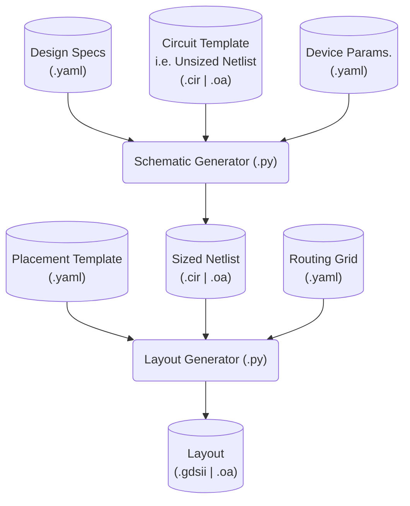

```mermaid
graph TD

A[("Design Specs
(.yaml)")]-->B("Schematic Generator (.py)")
C[("Circuit Template
i.e. Unsized Netlist
(.cir | .oa)")]-->B
D[("Device Params.
(.yaml)")]-->B
B-->E[("Sized Netlist
(.cir | .oa)")]

W[("Placement Template
(.yaml)")]-->Y("Layout Generator (.py)")
E-->Y
X[("Routing Grid
(.yaml)")]-->Y
Y-->V[("Layout
(.gdsii | .oa)")]
```