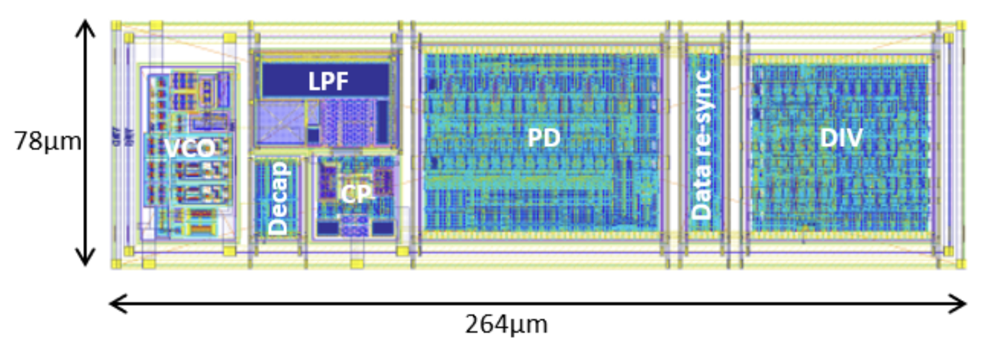
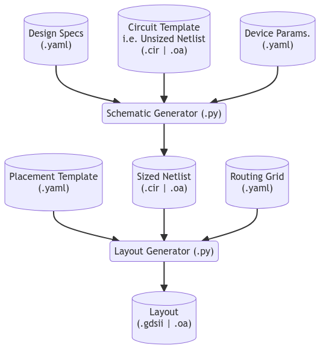
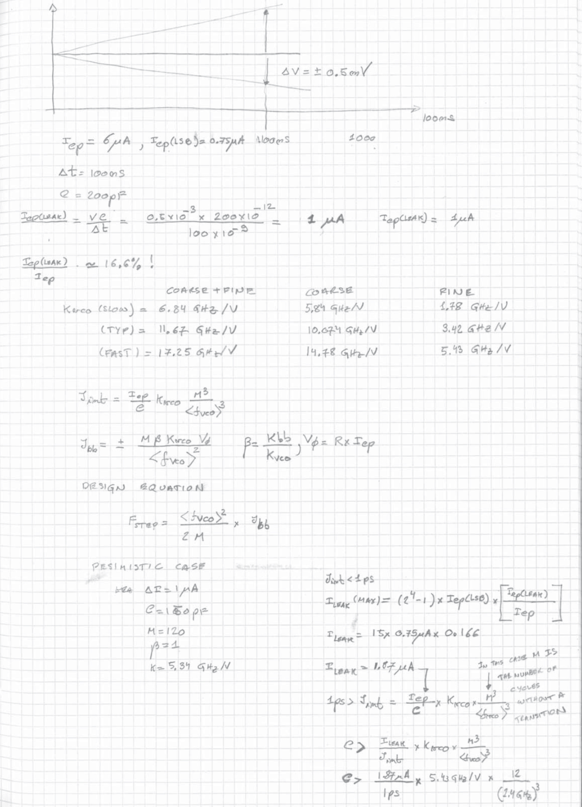
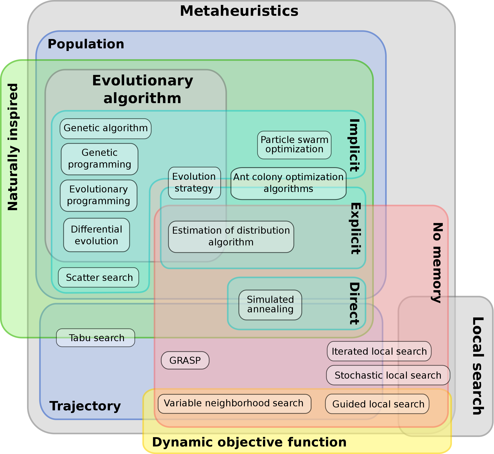
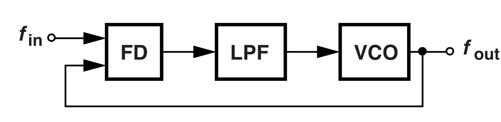

---
title:
- Generator-based approaches to IC design
author:
- Kennedy Caisley
date:
- 05 June, 2023
---

# Prior Work @ SiLab: Process Nodes

- Our designs have migrated over time
	- 2007-2011: 130nm
	- 2012-Present: 65nm
- Now 28nm is available, but:
	- 2-4x transistors -> longer simulation, layout, verification
	- 3x PDK/DRC rules
	- 2x cost (8k EUR/mm^2)
- Smaller != better
	- Must consider A vs D performance, power, area, cost
- ISSCC trend anecdote: 65nm is still most popular node

# Prior Work @ SiLab: PLL Designs

::: columns

:::: column
**Early DHP PLL, in 90nm, later ported to 65nm**

::::

:::: column
**Early RD53 PLL, 65nm, later grew to 600ux150u**

::::

:::

|Design|Fin(Hz)|Fout(Hz)|Jitter(s)|Power(W)|TID(Rad)|
|---|---|---|---|---|---|
|DHP|80M|1.6G|20p|1.25m VCO|20M|
|RD53|80M|1.28G|5p|6.5m|500M|

# Generators: What & Why

::: columns

:::: column
- Common analog 'IP' (IBias, VRef, PLL, IO, ADC, DAC) 
- Portable and/or parallel design (65nm or 28nm?)
- Record design method/intent (Why this W/L?)
- Faster modification (e.g. layout ECOs)
- General-purpose tooling (Python, C++, YAML)
::::

:::: column

::::

:::

# Generators: Procedural approach

::: columns

:::: column
- "White Box" mechanistic modeling & optimization
- Capture known solution to known problem
- Limited simulation for parameters -> fast
- Top-to-bottom: 'feedforward'
::::

:::: column

*'Procedural generator' circa 2013*
::::

:::

# Generators: Synthesis approach

::: columns

:::: column
- "Black Box" optimization; give computer constraints and objective and let it explore
- More formally: *Metaheuristic optimization*
	1. Produce a set of candidates
	2. Evaluate via simulation -> slow
	3. Retain best performing
	4. Iterate if necessary: 'feedback'
::::

:::: column

[*'Metaheuristics', Wikipedia*](https://en.m.wikipedia.org/wiki/Metaheuristic)

::::

:::

# Generators: When to use which type?

Choice of generator should vary by task:

- Sizing vs Layout: Either works for schematics; layout should probably be procedural
- Simulation vs Implementation: Real implementions are complex, so rely on templates
- Analog vs Digital: Use the correct paradigm (continuous vs discrete time)
- Device vs System: Increased complexity mandates abstration and constraints
- Regular vs Non-regular Arch.: Uniformity allows for simplicity

# Generators: Dos and don'ts
- **DO** create a deterministic generator (avoid random optimization convergence)
- **DO** use constraints (specs, schem/layout templates, routing grids, abstracted PDK/DRC)
- **DO** work in GP languages: flexibility, shared w/ real-world testing, readability, source control, sharing w/o NDA
- **DO** combine the procedural + synthesis (mimic what designers already do intuitive)
- **DO** partition generator code by cell view
- **DON'T** hide approach in neural network (human or machine)
	- Over-constrained procedural not reusable and ignores useful abstraction (drawing raw GDSII)
	- Under-constrained statistical approach time-consuming and meaningless (unsupervised learning)
- **DON'T** use for one-off/unique blocks or top-level
- **DON'T** expect SOTA performance, power, area

# Generators: Survey of Tools

- **[PyCell & OA PCell](https://arxiv.org/pdf/1607.00859.pdf)**: Parametric device-level models and layouts, mostly proprietary
- **[BAG](https://bag3-readthedocs.readthedocs.io)**: Device to block-level procedural generators; open source but Cadence dependent
- **[Hdl21](https://github.com/dan-fritchman/Hdl21)**: Circuit-level Analog HDL in Python for netlists, with aux. tools for layout; open source
- **[Gdstk](https://github.com/heitzmann/gdstk)**: Python lib, device-level layouts; open source
- **[ALIGN](https://github.com/ALIGN-analoglayout/ALIGN-public)**: Netlist to GDSII synthesis; mostly open source
- **[MAGICAL](https://github.com/magical-eda/MAGICAL)**: Netlist to GDSII synthesis; mostly open source
- **[Anagen](https://m.youtube.com/watch?v=IzJbVG-FHJc)**: Schematic/layout generator built on Cadence; proprietary from Infineon
- **[IIP Framework](https://www.eas.iis.fraunhofer.de/en/business_areas/efficient_electronics/automation-analog-design.html)**: Schematic/layout generator built on Cadence; proprietary from Fraunhaufer IIS
- **[Laygo](https://laygo2.github.io/)**: Python library; generate system-level layouts from custom cells
- **[OpenFASoC](https://openfasoc.readthedocs.io/)**: Generate analog netlists and layouts given Verilog netlist and standard cells; open source

# Next Steps: Generator approaches for PLL building blocks

::: columns

:::: column
- **Phase Freq. Detector**: Optimize at gate-level for speed, jitter, and noise margin. Then structually compose.
- **Charge Pump**: Optimize at trasistor-level for power and jitter, using iterative SPICE simulation and design eqns.
- **Low Pass Filter**: Optimize a LTI system model, then translate to passive devices.

::::

:::: column

- **Volt. Cont. Oscillator**: Typical performance bottleneck. Determine topology, then use optimization approach to size transistors.
- **Divider**: Again, just optimize lower-level gates for speed, jitter, and noise margin. Then structually compose.

[*'Design of CMOS Phase-Locked Loops', Razavi*](https://doi.org/10.1017/9781108626200)

::::

:::

# Next Steps

## Timeline

- Use Hdl21 (successor of BAG) as generator tool of choice
- Design generator that is 28 nm & 65 nm compatible
- TSMC 28 nm submission of prototype PLL via Europractice
- Apply generator concepts to new FE designs

## Potential Issues
- OpenAccess & Cadence
- Environment setup
- Alternate abstraction to learn (pro & con)