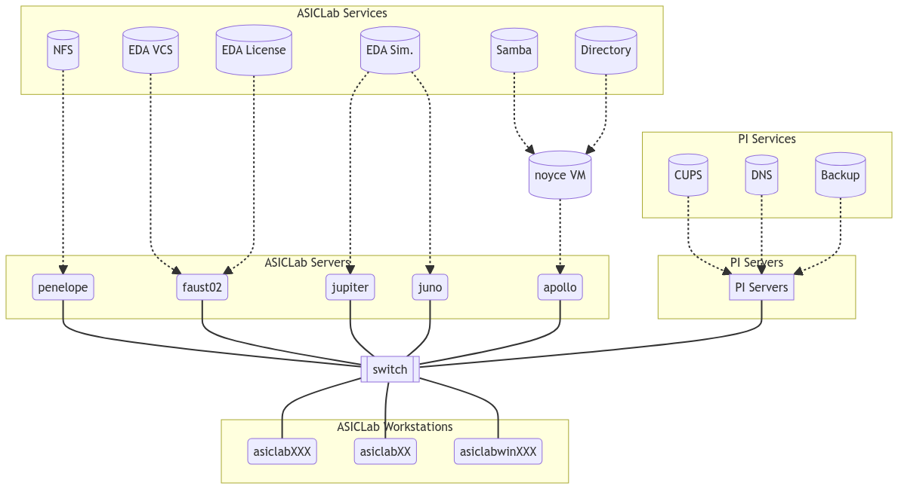

---
title:
- Updates to IT Infrastructure in ASICLab
author:
- Kennedy Caisley
date:
- 26 July, 2023
---

# Servers & Workstations


# Services & Apps


# Services & Apps



# Motivations

- Hard drive failures in network file server (NFS)
- Graphical login not working on some workstations
- Workstation config opaque and backups time-consuming (Clonezilla)
- CentOS 7 reaching end-of-life (released 2014)
    - Software and drivers not receiving updates
    - No CentOS 8 or 9 and similar EL projects at risk
- Documentation not easily maintainable (Confluence)
- BIOS never updated on some machines
- Plus, it's interesting 

# Project #1: An OS Upgrade

The first three categories are:
How much work would need to be invested initially + overtime in running these classes of software? This includes the mindshare, documentation, software availability, and ease software configuration.

*Questions: How much did RHEL cost?
How much does SLES cost?
What is the real support for SUSE/Open Suse for EDA?*

|Distribution | Design | Services | Desktop | Pricing | Future |
|---|---|---|---|---|---|
|RHEL       | ✅ | ✅ | 🆗 | 💰 | ✅ |
|Rocky/Alma | ✅ | ✅ | 🆗 | ✅ | 😬 |
|SUSE       | 🆗 | ✅ | 🆗 | 💰 | ✅ |
|OpenSUSE   | 🆗 | 🆗 | 🆗 | ✅ | ✅ |
|Ubuntu     | ❌ | 🆗 | ✅ | ✅ | ✅ |
|Fedora     | 🆗 | ✅ | ✅ | ✅ | ✅ |

We selected Fedora and so far the experience has reinforced the decision:

- Fedora installed across 2 servers and 14 workstations
- Some EDA tools work, and a work around has been found for others (to be discussed)
- Enterprise services are well supported, RHEL docs are mostly relevant
- Desktop apps are mostly available (Zoom, Slack, VSCode, etc)
- Successful version upgrades 36 -> 37 -> 38 -> 39 (soon)
- Bonus: Automatic firmware upgrades

# Project #2: A Better Way to Configure Workstations

*Need a better title*

- Now that we have a bunch of fresh machines:
    - How to take a machine from a fresh install -> desired state (and keep it that way)
    - Remember the old way was to configure one, and use Clonezilla
- Used for workstations only (just make root account, enable SSH), as we want the 12+8 machines to be the same
- Now using Ansible, whenever it make sense
    - State based or 'idempotent', rather than action based
        - Example: Write line to file
    - Replaces monolithic Clonezilla; force us to know our stack

1. Install `sudo dnf install ansible` on one controller machine
2. Copy SSH public key to all target machines `ssh-copy-id asiclab001.physik.uni-bonn.de`
3. List machines to target in `inventory.yaml`:

    ```yaml
    workstations:
    hosts:
        asiclab001.physik.uni-bonn.de:
        mac: 54:BF:64:98:25:D4
        asiclab002.physik.uni-bonn.de:
        mac: 54:BF:64:98:25:CC
        asiclab003.physik.uni-bonn.de:
        mac: 54:BF:64:98:25:BA
        ...
    ```

4. List desired machines state in `playbook.yaml`:

    ```yaml
    ...
    - name: Send a Wake-on-LAN magic packet
        community.general.wakeonlan:
        mac: '{{ mac }}'
        delegate_to: localhost
        tags: init

    - name: Install basic development tools
        ansible.builtin.dnf:
        name:
            - vim
            - tmux
            - htop
            - pandoc
            - curl
            - wget
        state: latest
        tags: update
    ...
    ```

5. Run on 

    ```bash
    $ ansible-playbook -K playbook.yaml --tags nfs -i inventory.yaml --limit asiclab001
    ```

6. Profit

    ```bash
    output showing it working
    ```

# Changes: Files Storage
- Installed Fedora on machine (`penelope`)
- Built a new Raid6 array with 48 TB of total HDD storage

```bash
command to show raid array
```

- Copied design data over from manual back (3+ days)
- Started NFS server on Fedora, with (renamed) `/tools` and `/users`

```yaml
- name: Create directory and mount /users
    ansible.posix.mount:
    src: penelope.physik.uni-bonn.de:/export/disk/users
    path: /users
    opts: rw
    boot: true
    state: mounted
    fstype: nfs4
    tags: nfs
```

```bash
$ ls /
dir dir dir dir dir tools users 
```

# Changes: Identity Management
- User data on `rw` NFS share
- Ported old LDAP data to modern FreeIPA distribution (LDAP, SSSD, NSS)
- Data protected using groups `base`, `icdesign`, `tsmc65`, etc
- Downside: No IdM or NFS = no login or crashing


Don't just manually add users

```bash
freeipa command to list users
```

Also available on GUI:


Then on client client
```bash
SHOULD PUT THE ANSIBLE VERSION
sudo realm join penelope.physik.uni-bonn.de
```

```bash
$ ls /home
asiclab

$ ls /users
dschuechter  kcaisley  krueger  mvogt  skahn  szhang  ydieter  ...
```

# Changes: EDA Tools
- Living on the read only NFS mount `tools`, executed on workstation
    - Must query against FlexLM and SOS to start
- EDA tools typically only certified on a handful of OSes (RHEL, Suse) [see here](https://www.cadence.com/content/dam/cadence-www/global/en_US/documents/support/2021-2024-cadence-compute-platform-roadmap-v1-public.pdf) 
- We can't easily use RHEL equivalents with RHEL rebuilds due to CentOS EOL, and RHEL source now being closed
- Turns out FPGA tools (ISE & Vivado) just work on Fedora
- In other, what would be hands would be to be able to run the software inside of a complete `OS virtual environment`, so that the tools sees all the right package versions: i.e. we want Containerization
- There are several choices (Docker, Podman, etc) but the best for our high-performance + GUI needs is `apptainer` best


```bash
$ ls /tools
cadence  clio  containers  designs  kits  mentor  synopsys  xilinx ...
```

1. Create a `.def` file, for target application. Add the following:

2. Select a starting OS base image (Docker compatible!)

    ```docker
    Bootstrap: docker
    From: centos:7
    ```
3. Create mount points for external locations; `$HOME` is already done

    ```docker
    %setup
    mkdir ${APPTAINER_ROOTFS}/tools
    mkdir ${APPTAINER_ROOTFS}/users
    ```

4. List packages to install on top of OS base image

    ```docker
    %post
    yum -y update && yum clean all
    yum install -y csh tcsh glibc gdb ... etc
    ```

5. Compile the container image:

```bash
[kcaisley@asiclab008]$ sudo apptainer build demo.img demo.def

INFO:    Starting build...
Getting image source signatures
INFO:    Running setup scriptlet
INFO:    Running post scriptlet
...
Complete!
INFO:    Adding environment to container
INFO:    Creating SIF file...
...
Done!
```

```bash
[kcaisley@asiclab008]$ cat /etc/redhat-release
Fedora release 38 (Thirty Eight)

[kcaisley@asiclab008]$ bash --version
GNU bash, version 5.2.15(1)-release (x86_64-redhat-linux-gnu)
Copyright (C) 2022 Free Software Foundation, Inc.

[kcaisley@asiclab008]$ apptainer shell demo.sif

Apptainer>

Apptainer> cat /etc/redhat-release 
CentOS Linux release 7.9.2009 (Core)

Apptainer> bash --version
GNU bash, version 4.2.46(2)-release (x86_64-redhat-linux-gnu)
Copyright (C) 2011 Free Software Foundation, Inc.
```

# Changes: Documentation
- Markdown, git repo (show screenshots)
- Ansible is more or less 'self-documenting', for the workstations

# Remaining Work + Problems
- 6/20 workstations still on CentOS7
- 3/5 Servers (Faust02/Jupiter/Juno) still on CentOS7
- Apollo decommission (is on CentOS 6)
- faust02 renamed to -> faust
- How to organize the lab? Still a mess.
- Bandwidth of access to NFS shares doesn't work well
- SSH keys don't work with LDAP users

- FreeIPA instance transfer
- Discussion: Should we port any of these changes elsewhere in the lab

# Up Next
- In two weeks
- GUI-based design Cadence and the alternative of Python-based Circuit generators

