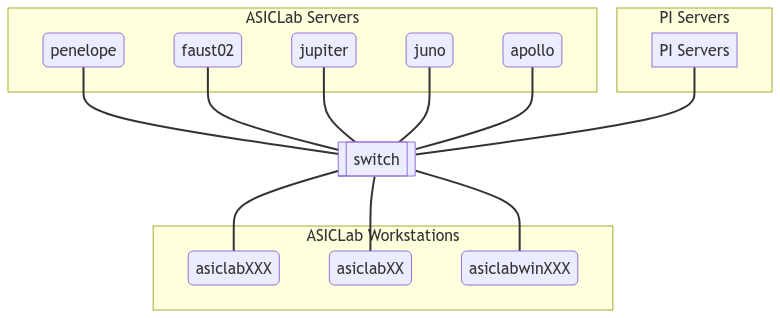
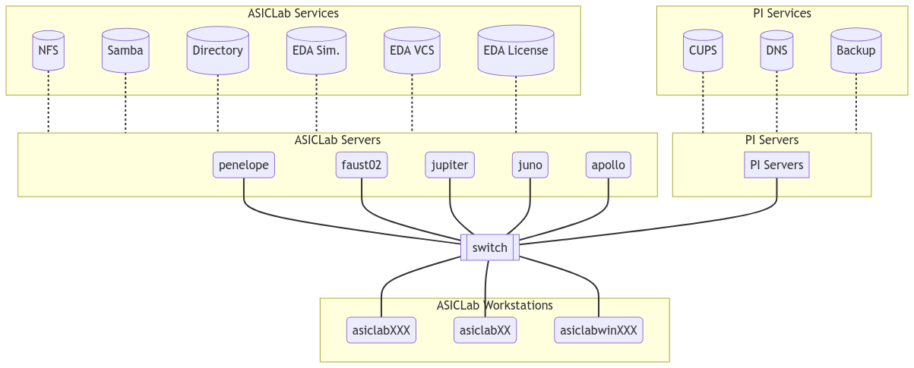
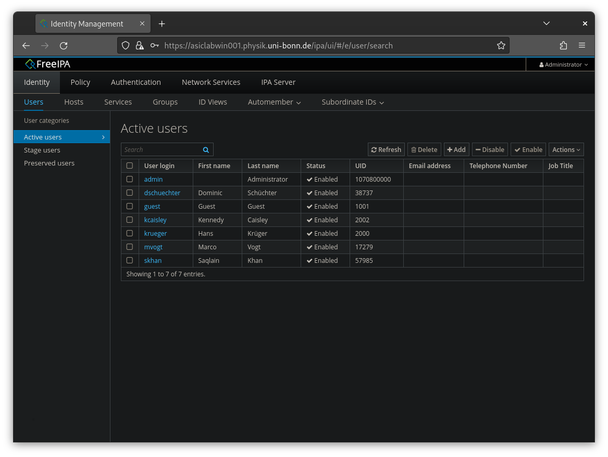
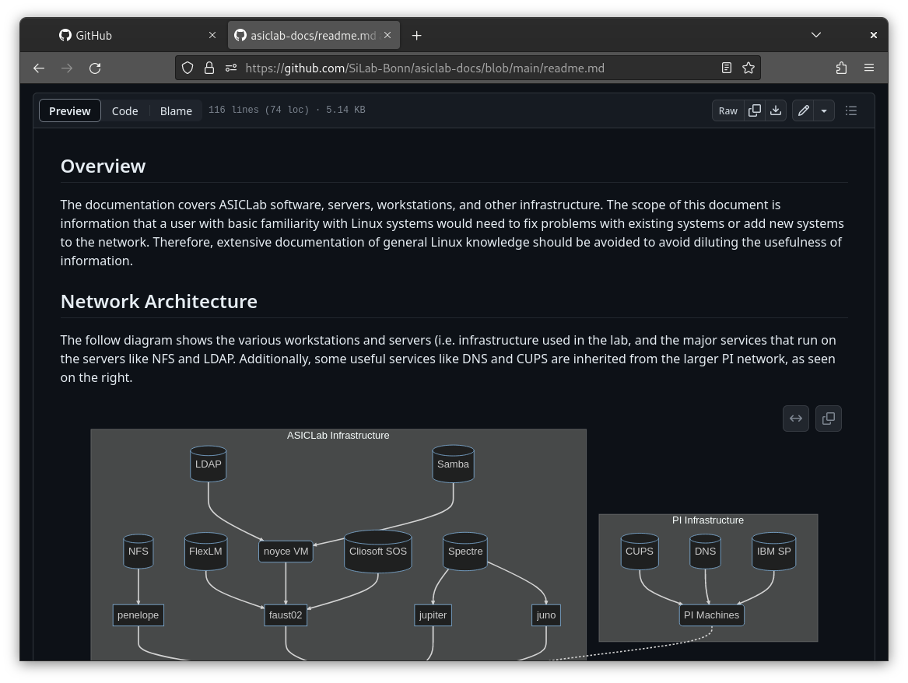
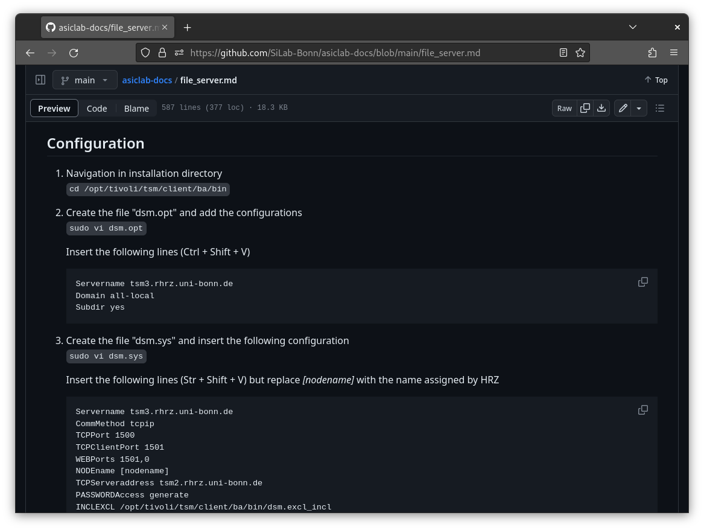

<!-- _class: lead -->

# ASICLab IT Upgrades 🖥️

<!-- Better title? -->

#### Kennedy Caisley
#### Marco Vogt

26 July 2023


---

### The physical network...

<!-- _class: lead -->



---

### ...with services running on top

<!-- _class: lead -->


---

### Motivations

 CentOS 7 reaching EOL with no upgrade path

💽 Drive failures & low storage in file server

🖥️ Workstations failing to boot & softwares outdated

🗃️ Config management opaque and slow

📗 Docs not maintain-ed | able

---
<!-- _class: lead -->

### Project #1: An OS Upgrade

<!-- The first three categories are:
How much work would need to be invested initially + overtime in running these classes of software? This includes the mindshare, documentation, software availability, and ease software configuration.

*Questions: How much did RHEL cost?
How much does SLES cost?
What is the real support for SUSE/Open Suse for EDA?* -->

|Distribution | Design | Services | Desktop | Pricing | Future |
|---|:---:|:---:|:---:|:---:|:---:|
| | ✅ | ✅ | 🆗 | 💰 | ✅ |
| | ✅ | ✅ | 🆗 | ✅ | 😬 |
|**SLES**  | 🆗 | ✅ | 🆗 | 💰 | ✅ |
|Open**SUSE** | 🆗 | 🆗 | 🆗 | ✅ | ✅ |
| | ❌ | 🆗 | ✅ | ✅ | ✅ |
| | 🆗 | ✅ | ✅ | ✅ | ✅ |

---

### , I choose you!

✅ Installed across 14 workstations and 2 servers

🆗 Some EDA tools run; work-around for the rest

✅ Enterprise services are well-supported & documented (RHEL)

✅ Desktop apps mostly available: i.e `zoom`, `slack`, `code`

✅ Automatic driver & firmware upgrades

✅ Successful version updates: **36** ➡️ **37** ➡️ **38** ➡️ **39** (soon)

---
<!-- _class: lead -->

### Project #2: Workstation Setup

`clonezilla` isn't the right tool for *Configuration Management*:

> The art of setting and maintaining a machine in its desired state.


<!-- - Now that we have a bunch of fresh machines:
    - How to take a machine from a fresh install -> desired state (and keep it that way)
    - Remember the old way was to configure one, and use Clonezilla
- Used for workstations only (just make root account, enable SSH), as we want the 12+8 machines to be the same
- Now using Ansible, whenever it make sense
    - State based or 'idempotent', rather than action based
        - Example: Write line to file
    - Replaces monolithic Clonezilla; force us to know our stack 
    contrast bash scripts, vs code, etc
    -->

 **Ansible** provides a simple, *idempotent* approach

---

1. `dnf install ansible` on a machine not being configured
2. `ssh-copy-id ` to all target machines 
3. List target machines in `inventory.yaml`:

    ```yaml
    workstations:
        hosts:
            asiclab001.physik.uni-bonn.de:
            mac: 54:BF:64:98:25:D4
            asiclab002.physik.uni-bonn.de:
            mac: 54:BF:64:98:25:CC
            asiclab003.physik.uni-bonn.de:
            mac: 54:BF:64:98:25:BAs
    ```
---

4. List desired state in `playbook.yaml`:
    ```yaml
    - name: Send a wake-on-LAN magic packet                                       
        community.general.wakeonlan:
            mac: '{{ mac }}'
    - name: Ensure client.conf exists & contains CUPS hostname
        ansible.builtin.lineinfile:
            path: /etc/cups/client.conf
            line: ServerName cups.physik.uni-bonn.de
            create: yes
    - name: Check development tools are installed
        ansible.builtin.apt:
            name:
            - gcc
            - tmux
            - git-lfs
            state: latest
    ```
---

5. Run playbook on target inventory:

    ```bash
    [asiclab@penelope ~]$ ansible -K playbook.yaml -i inventory.yaml
    ```

Some additional useful options:

⚙️ Only `--limit` to specific subset of machines

⚙️ Only run playbook tasks with certain `--tag`

⚙️ Be more `--verbose`

---

Ansible output log:

```log
PLAY [Workstation Configuration] *********************************************

TASK [Send a wake-on-LAN magic packet] ***************************************
ok: [asiclab001.physik.uni-bonn.de]
ok: [asiclab002.physik.uni-bonn.de]
ok: [asiclab003.physik.uni-bonn.de]

TASK [Ensure client.conf exists & contains CUPS hostname] ********************
ok: [asiclab001.physik.uni-bonn.de]
ok: [asiclab002.physik.uni-bonn.de]
changed: [asiclab003.physik.uni-bonn.de]

TASK [Check development tools are installed] *********************************
ok: [asiclab001.physik.uni-bonn.de]
changed: [asiclab002.physik.uni-bonn.de]
changed: [asiclab003.physik.uni-bonn.de]
```

<!-- - Config managment is a super complex field, and is mostly overboard for our group
- But in cases where you have a list of repeated, common tasks, that need to be done
on many machines, it's a very userful tool -->


---

<!-- _class: lead -->
### Project #3: Fixing the File Server

1.  Copied `/tools` and `/users` (~3 days)
2.  Built `raid6` array with **5** new 16 TB drives:
    - Capacity: 48 TB
    - Speed gain: 3x read, but no write
    - Fault tolerance: 2-drive failure (double parity)
3. Copied back data (another ~3 days)

---

Raid array details, seen from `penelope` server

```
[asiclab@penelope ~]$ sudo mdadm --detail /dev/md127

/dev/md127:
     Creation Time : Sat Jan 14 14:46:26 2023
        Raid Level : raid6
        Array Size : 46877242368 (43.66 TiB 48.00 TB)
     Used Dev Size : 15625747456 (14.55 TiB 16.00 TB)                            
      Raid Devices : 5
        Chunk Size : 512K

    Number   Major   Minor   RaidDevice State
       0       8       16        0      active sync   /dev/sdb
       1       8       32        1      active sync   /dev/sdc
       2       8       48        2      active sync   /dev/sdd
       3       8       64        3      active sync   /dev/sde
       4       8       80        4      active sync   /dev/sdf
```
---
4. Enable new incremental backups with HRZ using IBM `dsmc`
5. Enable automatic array checks with `raid-check.timer`
5. Enable `nfs4` server for `/users` and `/tools`.

A sanity check from `asiclab001` workstation:

```log
[asiclab@asiclab008 ~]$ showmount -e penelope.physik.uni-bonn.de                 

Export list for penelope.physik.uni-bonn.de:

/export/disk/tools   asiclab*,juno.physik.uni-bonn.de,noyce.physik.uni-bonn.de,
jupiter.physik.uni-bonn.de,faust02.physik.uni-bonn.de,apollo.physik.uni-bonn.de

/export/disk/users   asiclab*,juno.physik.uni-bonn.de,noyce.physik.uni-bonn.de,
jupiter.physik.uni-bonn.de,faust02.physik.uni-bonn.de,apollo.physik.uni-bonn.de
```

---

7. Use `ansible` to auto-mount NFS shares on all workstations:

```yaml
- name: Create mount points and mount /users
    ansible.posix.mount:
        src: penelope.physik.uni-bonn.de:/export/disk/users
        path: /users
        opts: rw
        state: mounted
        fstype: nfs4
- name: Create mount points and mount /tools
    ansible.posix.mount:
        src: penelope.physik.uni-bonn.de:/export/disk/tools
        path: /tools
        opts: ro
        state: mounted
        fstype: nfs4
```

---

<!-- _class: lead -->

### Project #4: Identity Management

Next, we want user accounts to match our directories:

```bash
[kcaisley@asiclab008]$ ls /users
dschuechter  kcaisley  krueger  mvogt  skahn  szhang  ...
```


Fedora includes a `ldap` + `nss` suite called **FreeIPA** 


1. Simply `ipa-server-install`, and browse to machine address:

---

<!-- _class: lead -->



---


2. Connect workstations to server with `ansible`'s `inventory.yaml`:

```yaml
ipaservers:
    hosts: faust02.physik.uni-bonn.de
    vars:
        ipaadmin_principal: admin
        ipaadmin_password: NotSoSecretPassword123
ipaclients:
    hosts:
        asiclab001.physik.uni-bonn.de
        asiclab002.physik.uni-bonn.de
        asiclab003.physik.uni-bonn.de
```

3. Run `ansible` to cache LDAP users on all machines ✅
---

### Project #5: Running EDA tools?

<!-- _class: lead -->

EDA tools, are mounted ...

```bash
$ ls /tools
cadence  clio  containers  designs  kits  mentor  synopsys  xilinx ...
```

... but some, like `virtuoso`, don't work on Fedora.

---

<!-- - Living on the read only NFS mount `tools`, executed on workstation
    - Must query against FlexLM and SOS to start
- EDA tools typically only certified on a handful of OSes (RHEL, Suse) [see here](https://www.cadence.com/content/dam/cadence-www/global/en_US/documents/support/2021-2024-cadence-compute-platform-roadmap-v1-public.pdf) 
- We can't easily use RHEL equivalents with RHEL rebuilds due to CentOS EOL, and RHEL source now being closed
- Turns out FPGA tools (ISE & Vivado) just work on Fedora
- In other, what would be hands would be to be able to run the software inside of a complete `OS virtual environment`, so that the tools sees all the right package versions: i.e. we want Containerization
- There are several choices (Docker, Podman, etc) but the best for our high-performance + GUI needs is `apptainer` best -->

<!-- _class: lead -->

The solution: 

*OS-level virtual environments* aka **"Containers"**

 **Docker** is a popular tool, but..

 **Apptainer** is designed for high-performance apps with GUI

---

### To build a container:

1. Create a `.def` file, for target application. Add the following:

2. Select a starting OS base image (Docker compatible!)

    ```docker
    Bootstrap: docker
    From: centos:7
    ```
3. Create mount points for external locations; `$HOME` is already done:

    ```docker
    %setup
    mkdir ${APPTAINER_ROOTFS}/tools
    mkdir ${APPTAINER_ROOTFS}/users
    ```

---

4. List packages to install on top of OS base image:

    ```docker
    %post
    yum -y update && yum clean all
    yum install -y csh tcsh glibc gdb                                          
    ```

5. Compile the container image:

    ```bash
    [kcaisley@asiclab008]$ sudo apptainer build demo.img demo.def                    

    INFO:    Starting build...
    Getting image source signatures
    INFO:    Running setup scriptlet
    INFO:    Running post scriptlet
    INFO:    Adding environment to container
    INFO:    Creating SIF file...
    ✅ Done! 
    ```

```bash
[kcaisley@asiclab008]$ cat /etc/redhat-release
Fedora release 38 (Thirty Eight)

[kcaisley@asiclab008]$ bash --version
GNU bash, version 5.2.15(1)-release (x86_64-redhat-linux-gnu)
Copyright (C) 2022 Free Software Foundation, Inc.

[kcaisley@asiclab008]$ apptainer shell demo.sif

Apptainer>

Apptainer> cat /etc/redhat-release 
CentOS Linux release 7.9.2009 (Core)

Apptainer> bash --version
GNU bash, version 4.2.46(2)-release (x86_64-redhat-linux-gnu)
Copyright (C) 2011 Free Software Foundation, Inc.
```

---

<!-- _class: lead -->


---

# Project #6: Write the docs
<!-- _class: lead-->

Tool criteria:


### `confluence.atlassian.com` is 📉

### `.md` + `github.com` is 📈

---

<!-- _class: lead -->



---

<!-- _class: lead -->



---


#### Takeaways:

 is a good distro for EDA environments

 **Ansible** is useful for workstations (but less so servers)

`raid` + `nfs` can serve `$HOME` directories and tools (with some limits)

 **FreeIPA** makes LDAP user management easy

 **Apptainer** can run EDA apps on unsupported distros

`.md` in a `git` repo simplifies documentation