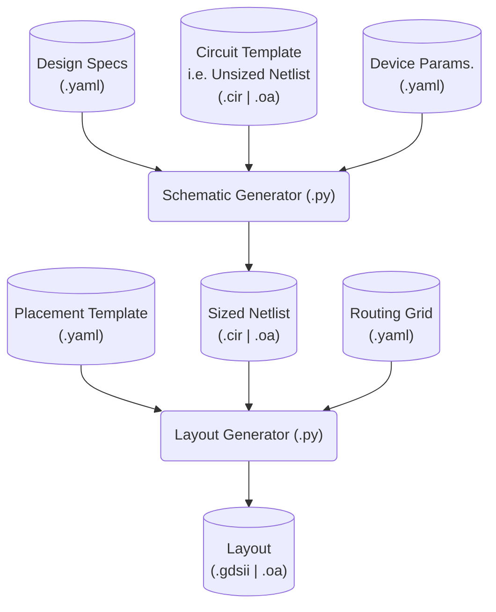

# Slides

# Prior Work: Background
- 2007-2011: 130nm, 2012-Present: 65nm
- 28nm available now, but:
	- 2-4x transistors -> longer simulation, layout, verification
	- 3x PDK/DRC rules
	- 2x cost (8k EUR/mm^2)
- Choice depends: A vs D performance, power, area, cost
- ISSCC stats reflect this

# Prior Work: PLL Designs

*Early DHP PLL, in 90nm, later ported to 65nm*

 

*Early RD53 PLL, 65nm, layer grew to 600x150u*

|Design|Fin(Hz)|Fout(Hz)|Jitter(s)|Power(W)|TID(Rad)|
|---|---|---|---|---|---|
|DHP|80M|1.6G,800M,320M|20p|1.25m VCO|10-20M|
|RD53|80M|1.28G|5p|6.5m|500M|

# Generators: What & Why
- Common analog 'IP' (IBias, VRef, PLL, IO, ADC, DAC) 
- Portable and/or parallel design (65nm or 28nm?)
- Record design method/intent (Why this W/L?)
- Faster modification (e.g. layout ECOs)
- General-purpose tooling (Python, C++, YAML)

## Example Workflow

# Generators: Procedural

- "White Box" mechanistic modeling & optimization
- Capture known solution to known problem
- Limited simulation for parameters -> Fast
- Top-to-bottom: 'feedforward'

![[IMG_1500.jpeg]]
*Rare 'procedural generator' specimen, circa 2013*

# Generators: Synthesis 

- "Black Box" optimization; give computer constraints and objective and let it explore
- More formally: *Metaheuristic optimization*
	1. Produce a set of candidates
	2. Evaluate via simulation -> Slow!
	3. Retain best performing
	4. Iterate if necessary: 'feedback'

![[IMG_1501.png]]
[https://en.m.wikipedia.org/wiki/Metaheuristic](https://en.m.wikipedia.org/wiki/Metaheuristic)

# Generators: When to use which type?

Sizing vs Layout: Sizing can be either; or combination, analog layout should probably always be procedural
Linear ⇔ Non-Linear: 

Linear vs non-linear: aligns with structural vs functional
System vs device
structural (does the block compose, like digital circuits, or does the functionality need to be analyzed after) vs functional 

regular vs non-regular): This is more common in 28nm!!
Schematic vs layout

# Generators: Dos and don'ts
- **DO** create a deterministic generator (e.g. avoid random optimization convergence)
- **DO** use constraints (specs, schem/layout templates, routing grids, abstract PDK/DRC)
- **DO** work in GP languages: flexibility, shared w/ real-world testing, readability, source control, sharing w/o NDA
- **DO** combine the procedural + synthesis (Mimics what designers already do intuitive)
- **DO** partition generator code by cell view
- **DON'T** hide method in opaque neural networks (human or machine)
	- Overconstrained procedural not reusable and ignores useful abstraction (e.g. drawing raw GDSII)
	- Underconstrained statistical approach time-consuming and meaningless, (e.g. unsupervised learning
- **DON'T** use for one-off/unique blocks or top-level
- **DON'T** expect SOTA performance, power, area

# Generators: Survey of Tools

* **PCell & PyCell**: W&L -> OA Layout+BSIM6, SKILL or Python/OA
- BAG: OA Schem Template -> OA Schem, Python+SKILL
- Hdl21 / Layout21

* **gdstk(prev. gdspy)**: Python -> GDSII, Python
- MAGICAL: 
- ALIGN: Netlist -> GDSII, Python, FOSS [1](https://github.com/ALIGN-analoglayout/ALIGN-public)
- Anagen - ????? Closed source, ) [1](https://m.youtube.com/watch?v=IzJbVG-FHJc)
- gdstk

## Potential Issues
- OpenAccess & Cadence
- Environment setup
- Alternate abstraction to learn (pro & con)

# Next Steps: Application

![PLL Diagram]

- Phase/Freq. Detector:  Depending on Linear, Bang-Nonlinear. Noise Margin Suppresses Voltage Noise, mostly digital, this is a irregular but structural block, low gate/stage block, so this is best followed via a strictly procedural generation for schematic and layout. Can likely build from standard cells. Jitter does matter though.
- Charge Pump: 
- Low Pass Filter: Passive, and so can be considered linear quite easily. Relatively straiforward to  solved with procedural sizing and layout.
- Volt. Controlled Oscillator: Dominant source of jitter, can be very nonlinear around the 
- Divider: Straightforward for synchronous design, similar to PFD, take advantage of noise noise margin intrinsic to nonlinear operation, just pay attention to layout parasitic, jitter

![[IMG_1502 1.jpeg]]

[B. Razavi, Design of CMOS Phase-Locked Loops](https://doi.org/10.1017/9781108626200)

# Next Steps: Timeline

- Design generator that is 28 nm + 65 nm compatible
- TSMC 28 nm submission of demonstrator PLL via Europractice
- Apply generator concepts to new FE designs

# Questions

- Ratio of PLL power to chip as a whole?
- How big is analog chip bottom in RD53?
- Target timeline for submission?
- Use knowledge to build time based FEs
- Al's Hans about CERN PLL!

Code and diagram of layout
Know synthesis types
It work: nfs/backup, ldap users, PDK, Fedora linux, containerized cadence, doccumentation
Bag workflow diagram

0.1-0.7w /cm2 typical

Obelix has no pll, what is ddr design for driver?
