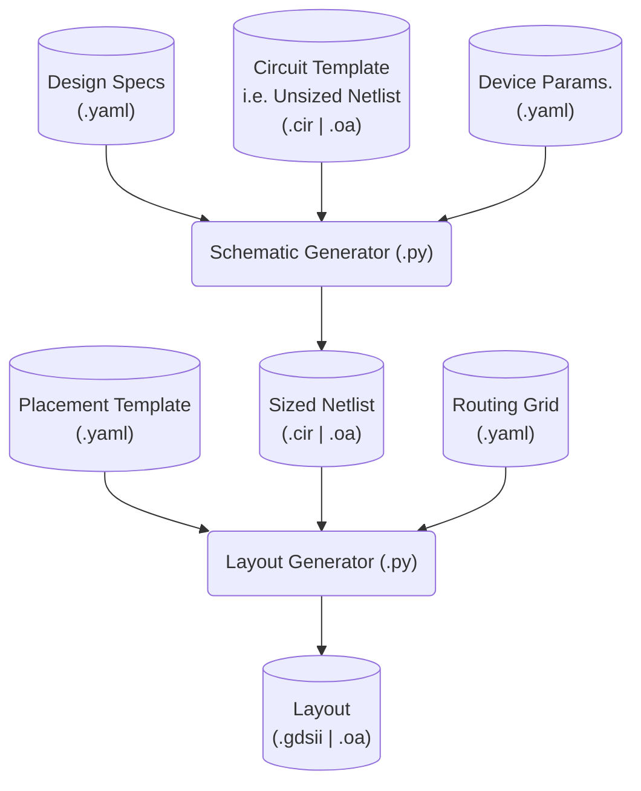
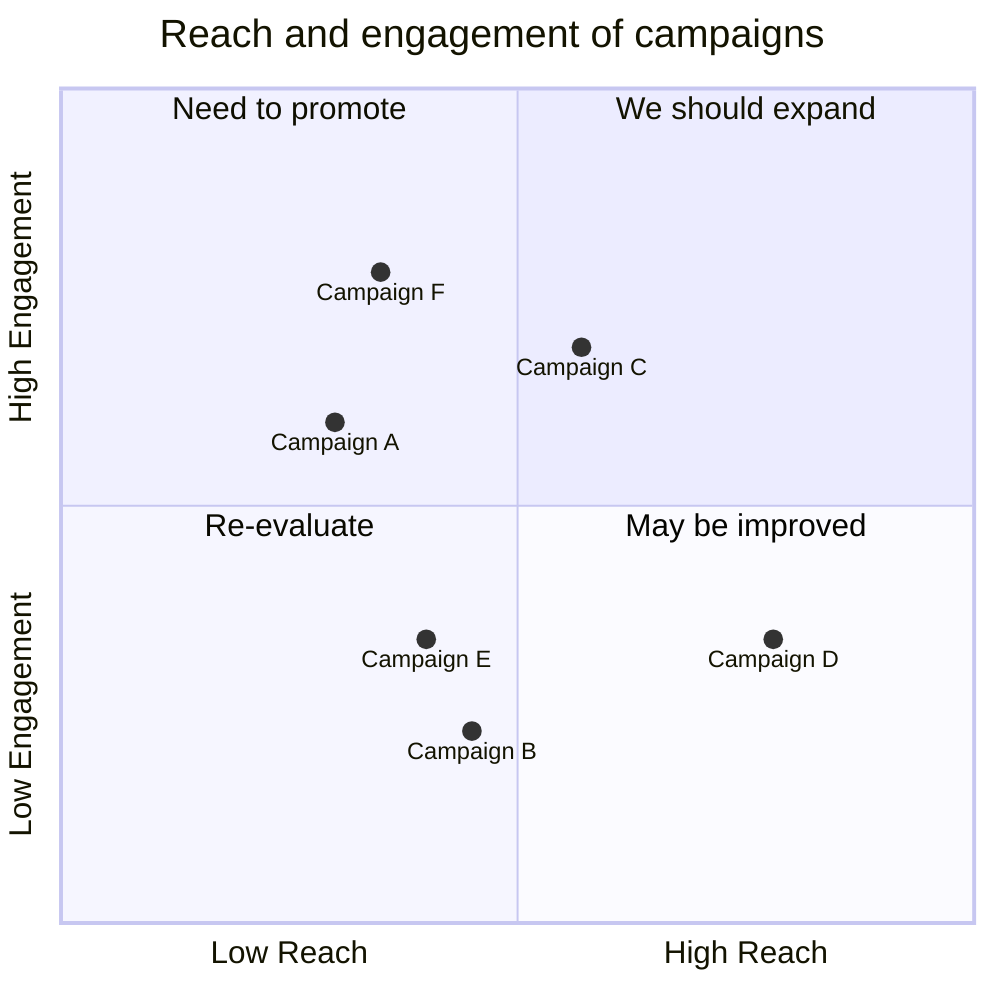

# Prior Work: Tech
- 2007-2011: 130nm, 2012-Present: 65nm
- 28nm available now, but:
	- 2-4x transistors -> longer simulation, layout, verification
	- 3x PDK/DRC rules
	- 2x cost (8k EUR/mm^2)
- Choice depends: A vs D performance, power, area, cost
- ISSCC stats reflect this

# Prior Work: PLL Designs
![[IMG_1496.png]]

![[IMG_1495.jpeg]]

65nm,1.2V±10%, Rad-Hard,

|Design|Fin(Hz)|Fout(Hz)|Jitter(s)|Power(W)|TID(Rad)
|---|---|---|---|---|
|DHP|80M|1.6G,800M,320M|20p||10-20M|
|RD53||1.28G|20ps|||

# Generators: What & Why
- Common analog 'IP' (IBias, VRef, PLL, IO, ADC, DAC) 
- Portable and/or parallel design (65nm or 28nm?)
- Record design method/intent (Why this W/L?)
- Faster modification (e.g. layout ECOs)
- General-purpose tooling (Python, C++, YAML)

## Example Workflow

# Generators: Procedural

- "White Box" mechanistic modeling & optimization
- Capture known solution to known problem
- Limited simulation for parameters -> Fast
- Top-to-bottom: 'feedforward'

![[IMG_1500.jpeg]]
* Rare 'procedural generator' specimen, circa 2013*

# Generators: Synthesis 

"Black Box" optimization

1. Produce a set of candidates
2. Evaluate via simulation -> Slow!
3. Retain best performing
4. Iterate if necessary: 'feedback'

More formally: *Metaheuristic optimization*

![[IMG_1501.png]]
[https://en.m.wikipedia.org/wiki/Metaheuristic](https://en.m.wikipedia.org/wiki/Metaheuristic)

# Generators: When to use which type?

Linear vs non-linear: aligns with structural vs functional
System vs device
structural vs functional (regular vs non-regular): This is more common in 28nm!!
Schematic vs layout

# Generators: Rules of Thumb
- **DO** create a deterministic generator (e.g. avoid random optimization convergence)
- **DO** use constraints (specs, schem/layout templates, routing grids, abstract PDK/DRC)
- **DO** work in GP languages: flexibility, shared w/ real-world testing, readability, source control, sharing w/o NDA
- **DO** combine the two types (What designers already do intutitive)
- **DON'T** hide method in opaque neural networks (human or machine)
	- Overconstrained procedural not reusable and ignores useful abstraction (e.g. drawing raw GDSII)
	- Underconstrained statistical approach time-consuming and meaningless, (e.g. unsupervised learning
- **DON'T** use for unique blocks or top-level
- **DON'T** expect SOTA performance, power, area

# Generators: Survey of Tools

* **PCell & PyCell**: W&L -> OA Layout+BSIM6, SKILL or Python/OA
- BAG: OA Schem Template -> OA Schem, Python+SKILL
- Hdl21 / Layout21

* **gdstk(prev. gdspy)**: Python -> GDSII, Python
- MAGICAL: 
- ALIGN: Netlist -> GDSII, Python, FOSS [1](https://github.com/ALIGN-analoglayout/ALIGN-public)
- Anagen - ????? Closed source, ) [1](https://m.youtube.com/watch?v=IzJbVG-FHJc)
- gdstk

## Potential Issues
- OpenAccess & Cadence
- Environment setup
- Alternate abstraction to learn (pro & con)

# Generators: Example Application

![PLL Diagram]

- PFD:  -->
- Charge Pump:
- Filter: 
- VCO: 
- Divider: Straighforward

![[IMG_1502 1.jpeg]]

[B. Razavi, Design of CMOS Phase-Locked Loops](https://doi.org/10.1017/9781108626200)

